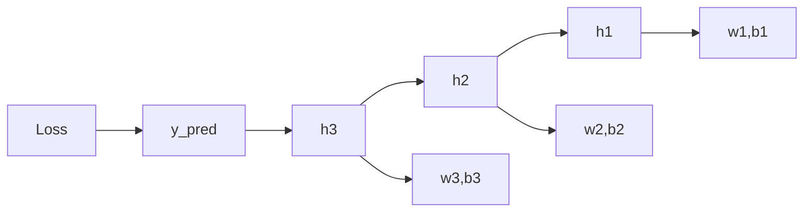
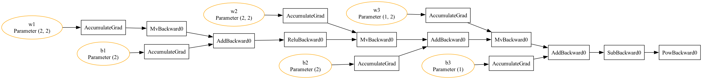

# Chapter 01 Code Logic README（完整版讲义）

## 0. 读者定位与学习目标
这份讲义面向“刚接触 PyTorch 自动微分”的同学。读完后你应该能做到：
1. 用一句话解释 `loss.backward()` 的本质。
2. 看到任意一条梯度公式时，能快速判断它的 shape 是否正确。
3. 把代码里的中间变量（`h1/h2/h3/y_pred/loss`）和反向传播路径对应起来。
4. 在梯度不匹配时，知道从哪里定位问题。

## 1. 先给结论：这一章到底在讲什么
如果只记一个结论，请记这个：

> 自动微分不是“神秘黑盒”，而是把链式法则拆成图上的局部规则，然后在反向阶段按图结构逐步累积梯度。

本章用三个层次把这个结论讲清楚：
1. 标量函数：你可以手算，验证最直观。
2. 矩阵函数：进入工程常见的 VJP（Vector-Jacobian Product）。
3. 四层网络：把“多层链路 + 参数梯度 + 图可视化”串成完整闭环。

## 2. 运行入口与建议顺序
### 2.1 最小运行命令
```bash
python chapter_01_tensor_autograd/autograd.py
```

### 2.2 推荐学习顺序
1. 先运行脚本，观察日志中的 `Step 1/4 -> Step 4/4`。
2. 再看本讲义第 6 节的“变量与 shape 对照表”。
3. 最后打开 `four_layer_autograd_graph.png` 对照梯度回传路径。

## 3. 文件地图（从“看哪里”到“怎么看”）
| 文件 | 职责 | 建议关注函数/类 |
|---|---|---|
| `autograd.py` | 主流程与三个示例 | `SimpleScalarGraph`, `ComplexMatrixGraph`, `FourLayerNetWithLoss`, `main` |
| `graph_visualization.py` | 计算图导出 | `build_dot(var, params)` |
| `dim_transform_torch.py` | 张量维度操作辅助理解 | `analyze_tensor` |
| `tensor_dim_transform.md` | 维度变换讲义 | `view/permute/transpose` 直觉 |

## 4. 全局执行流程（代码层）
```mermaid
flowchart TD
    A[main] --> B[setup_seed + get_device]
    B --> C[SimpleScalarGraph.verify]
    B --> D[ComplexMatrixGraph.verify]
    B --> E[FourLayerNetWithLoss.verify]
    E --> F[build_dot(loss)]
    F --> G[Export Graph PNG]
```

## 5. 反向传播主干图（概念层）


讲义式理解：
1. `Loss` 是反向传播起点。
2. 每个节点只做“局部导数 × 上游梯度”。
3. 参数节点（`w*`, `b*`）拿到的是“可更新的最终梯度”。

## 6. 三个示例的逐段精讲

### 6.1 示例 A：标量图（SimpleScalarGraph）
目标函数：
\[
z = x \cdot y + \sin(x)
\]

手推梯度：
\[
\frac{\partial z}{\partial x} = y + \cos(x), \quad
\frac{\partial z}{\partial y} = x
\]

代码里 `verify()` 被拆成四步：
1. Forward：打印 `x,y,a,b,z`。
2. Autograd：调用 `backward()` 得到 `x.grad,y.grad`。
3. Manual：手推公式计算梯度。
4. Compare：`allclose` 对比结论。

你要关注的不是“值多大”，而是“值是否一致”。一致就说明链式法则理解正确。

### 6.2 示例 B：矩阵图（ComplexMatrixGraph）
前向：
\[
Y = XW + b
\]

已知上游梯度 \(\frac{\partial L}{\partial Y}\)，验证：
\[
\frac{\partial L}{\partial W} = X^T \frac{\partial L}{\partial Y}
\]
\[
\frac{\partial L}{\partial X} = \frac{\partial L}{\partial Y}W^T
\]
\[
\frac{\partial L}{\partial b} = \sum_{batch} \frac{\partial L}{\partial Y}
\]

这里最容易错的是 shape。建议你每次都做“维度心算”：
1. `X: (B, I)`
2. `W: (I, O)`
3. `Y: (B, O)`
4. `dL/dW` 必须是 `(I, O)`，所以一定是 `X^T @ dL/dY`

### 6.3 示例 C：四层网络（FourLayerNetWithLoss）
前向链路：
\[
h_1 = W_1x + b_1
\]
\[
h_2 = ReLU(h_1)
\]
\[
h_3 = W_2h_2 + b_2
\]
\[
\hat{y} = W_3h_3 + b_3
\]
\[
L = (\hat{y} - y)^2
\]

教学重点不是“层数”，而是“局部规则可组合”：
1. 先从 `loss -> y_pred`。
2. 再向前到 `h3`。
3. 然后经过 ReLU 门控（正区间导数 1，负区间导数 0）。
4. 最后回到第一层参数。

## 7. 变量与 shape 对照表（建议边跑边看）
| 模块 | 前向变量 | 反向变量 | 必查点 |
|---|---|---|---|
| 标量 | `x,y,a,b,z` | `dL/dx,dL/dy` | autograd 与手推一致 |
| 矩阵 | `X,W,b,Y,upstream_grad` | `dL/dX,dL/dW,dL/db` | 乘法方向与 shape 一致 |
| 四层网络 | `h1,h2,h3,y_pred,loss` | `dw1,db1,dw2,db2,dw3,db3` | 每个参数都 `Grad Match=True` |

## 8. 本次真实运行结果（已执行）
### 8.1 命令
```bash
python chapter_01_tensor_autograd/autograd.py
```

### 8.2 关键日志结论
1. 标量：`Grad X Match = True`, `Grad Y Match = True`
2. 矩阵：`Grad X/W/b Match = True`
3. 四层：`w1,b1,w2,b2,w3,b3` 全部 `Grad Match = True`

### 8.3 文件产物
| 文件 | 作用 | 大小 | 更新时间 |
|---|---|---:|---|
| `four_layer_autograd_graph.png` | 四层网络计算图可视化 | 69689 bytes | 2026-02-24 19:45:30 |

### 8.4 结果图


读图提示：
1. 从 `Loss` 开始逆向看边。
2. 找到每个参数节点的连接路径。
3. 路径就是“梯度依赖关系”。

## 9. 调试手册（遇错时按顺序排查）
1. 报 `ModuleNotFoundError: torch`
   - 先确认当前 Python 环境已安装 PyTorch。
2. 梯度 mismatch
   - 先看 shape，再看转置，再看广播。
3. 四层图导不出来
   - 检查 Graphviz 是否可用、路径是否可写。
4. 某些 `.grad` 是 `None`
   - 确认是否是叶子节点，或是否需要 `retain_grad()`。

## 10. 课后练习（从会用到会讲）
1. 把标量函数改成 `z = x^2*y + cos(y)`，手推并验证。
2. 把矩阵示例的 `B/I/O` 改大，观察日志和内存变化。
3. 给四层网络加一层非线性，自己写出完整反向链路后再跑代码。
4. 尝试在 `build_dot` 里给节点添加更多标签（如张量 dtype）。

## 11. 一句话总复盘
你已经把“自动微分”从一句 API 调用，拆解成了“图结构 + 局部导数 + 梯度累积”的可解释过程。这就是后续学习 CNN/RNN/Transformer 训练机制的地基。
