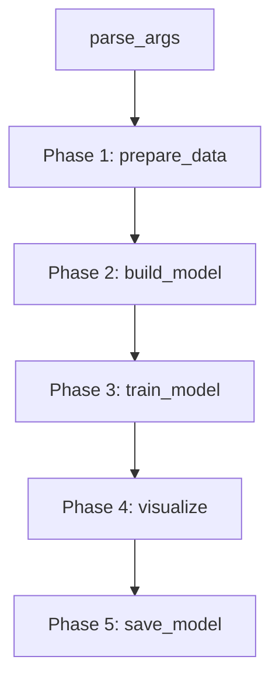
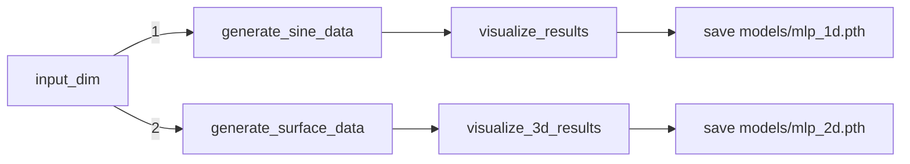
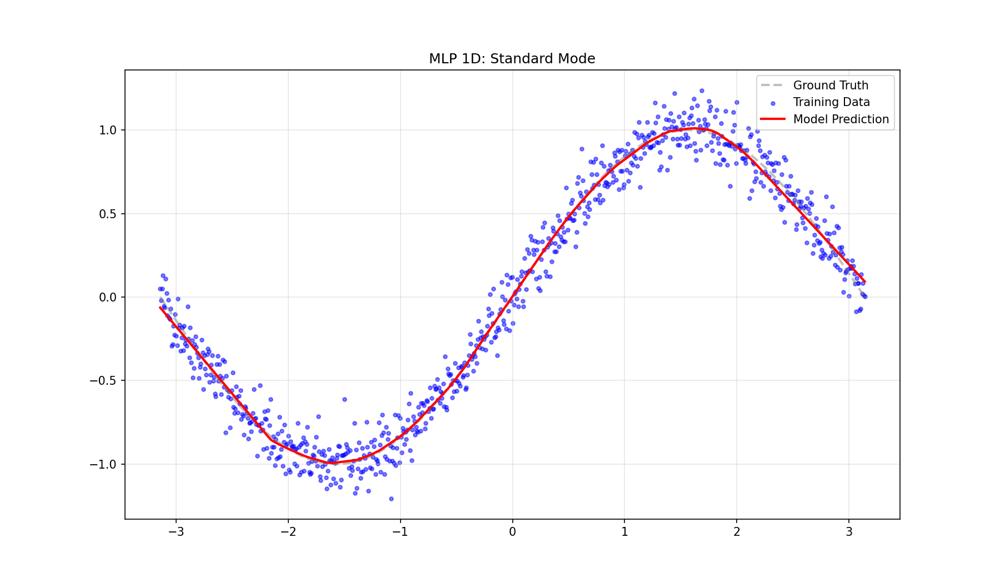
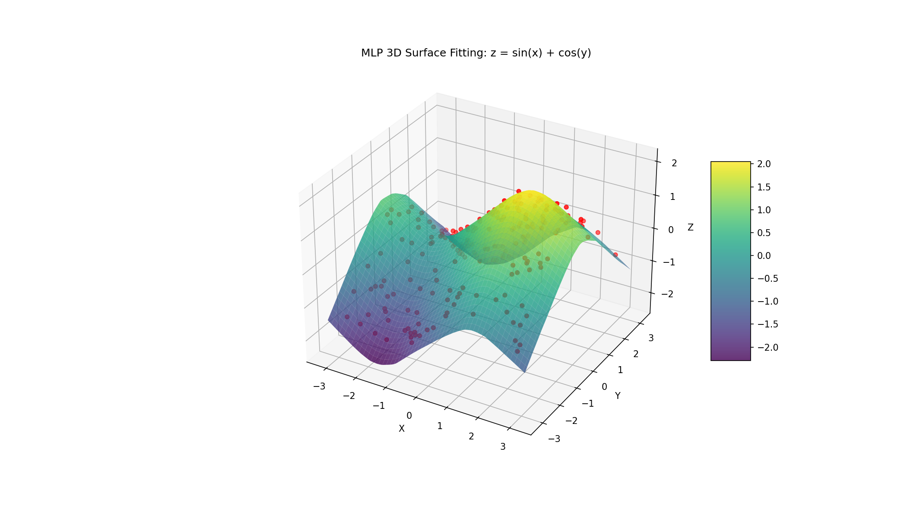

# Chapter 02 Code Logic README（完整版讲义）

## 0. 读者定位与学习目标
这份讲义面向“刚学完线性层与激活函数，准备理解 MLP 训练流程”的读者。

完成本章后你应该能：
1. 解释为什么 MLP 能拟合非线性函数。
2. 看懂从参数解析到保存模型的完整训练流水线。
3. 区分 1D 曲线拟合和 2D 曲面拟合两条分支的共同点与差异。
4. 用 loss 曲线和结果图判断训练是否有效。

## 1. 先给结论：本章在训练什么能力
本章不是在“记模型结构”，而是在建立这条思维链：

> 数据分布 -> 网络表达能力 -> 优化过程 -> 可视化验证 -> 模型落盘复用

一个关键点：
同一个 MLP 框架在输入维度切换后，可以处理不同形态的函数拟合任务，这就是“可复用训练骨架”的雏形。

## 2. 运行入口与建议顺序
### 2.1 运行命令
```bash
# 1D 曲线拟合
python chapter_02_nn_basics_mlp/mlp.py --input_dim 1 --mode standard --epochs 150 --lr 0.01 --hidden_dim 128 --n_samples 800

# 2D 曲面拟合
python chapter_02_nn_basics_mlp/mlp.py --input_dim 2 --epochs 120 --lr 0.01 --hidden_dim 128 --n_samples 1200
```

### 2.2 推荐学习顺序
1. 先跑 1D，建立“训练与可视化对应关系”。
2. 再跑 2D，看同一骨架如何扩展到多维输入。
3. 最后读代码函数分层，理解“为什么这样拆更清晰”。

## 3. 文件地图（单文件中的模块化）
| 函数/模块 | 角色 | 重点问题 |
|---|---|---|
| `parse_args()` | 配置入口 | 运行时到底能调哪些参数 |
| `prepare_data()` | 数据分支调度 | `input_dim` 如何改变数据形态 |
| `build_model()` | 模型构建 | 输入维变化对首层的影响 |
| `train_model()` | 核心训练循环 | 为什么顺序必须是四步 |
| `visualize_pipeline()` | 结果展示 | 如何判断模型学到了趋势 |
| `save_model_checkpoint()` | 产物管理 | 如何把实验结果沉淀为复用资产 |
| `mlp_demo()` | 总调度器 | 五阶段编排逻辑 |

## 4. 总体流程图（你应该背下来）


## 5. 分支流程图（1D 与 2D）


讲义式理解：
1. 分支差异主要在“数据生成与可视化”。
2. 训练主循环本身基本不变，这就是工程上常说的“训练模板复用”。

## 6. 训练循环深讲（必须掌握）
本项目训练循环按标准四步执行：
1. Forward：`y_pred = model(x_train)`
2. Zero Grad：`optimizer.zero_grad()`
3. Backward：`loss.backward()`
4. Step：`optimizer.step()`

为什么不能乱序：
1. 不先 `zero_grad()` 会梯度累积，导致更新方向失真。
2. 不 `backward()` 就没有参数梯度。
3. 不 `step()` 参数不会更新，loss 无法持续下降。

## 7. 数学视角：你在拟合什么
### 7.1 1D 任务
目标近似：
\[
y \approx \sin(x)
\]

### 7.2 2D 任务
目标近似：
\[
z \approx \sin(x) + \cos(y)
\]

同一网络模板：
\[
\hat{y} = W_2\,\sigma(W_1x + b_1) + b_2
\]

当输入从 \(x \in \mathbb{R}\) 变到 \((x,y) \in \mathbb{R}^2\)，你只是改变了第一层输入维，后续优化机制不变。

## 8. 变量与 shape 对照（看日志时用）
| 阶段 | 关键变量 | 典型 shape | 你要确认的点 |
|---|---|---|---|
| 数据准备 1D | `x_train, y_train` | `(N,1), (N,1)` | 曲线点分布是否合理 |
| 数据准备 2D | `x_train, y_train` | `(N,2), (N,1)` | 输入维是否为 2 |
| 模型构建 | `MLP(input_dim, hidden_dim, 1)` | 首层 `Linear(input_dim, hidden_dim)` | 与分支一致 |
| 训练 | `y_pred, loss` | `(N,1), scalar` | loss 是否整体下降 |
| 保存 | `vis_path, model_path` | 字符串路径 | 产物是否落盘 |

## 9. 本次真实运行结果（已执行）
### 9.1 命令
```bash
python chapter_02_nn_basics_mlp/mlp.py --input_dim 1 --mode standard --epochs 150 --lr 0.01 --hidden_dim 128 --n_samples 800
python chapter_02_nn_basics_mlp/mlp.py --input_dim 2 --epochs 120 --lr 0.01 --hidden_dim 128 --n_samples 1200
```

### 9.2 关键日志结论
1. 1D：最终 loss 约 `0.009833`
2. 2D：最终 loss 约 `0.012670`
3. 两条分支均完成“可视化 + 模型落盘”。

### 9.3 结果文件清单
| 文件 | 说明 | 大小 | 更新时间 |
|---|---|---:|---|
| `models/mlp_1d.pth` | 1D 模型权重 | 3464 bytes | 2026-02-24 19:45:40 |
| `models/mlp_2d.pth` | 2D 模型权重 | 3976 bytes | 2026-02-24 19:45:50 |
| `images/mlp_1d_standard_result.png` | 1D 拟合图 | 124744 bytes | 2026-02-24 19:45:40 |
| `images/mlp_2d_surface_result.png` | 2D 曲面图 | 389939 bytes | 2026-02-24 19:45:50 |

### 9.4 结果图展示



读图方法：
1. 1D 图看“预测曲线是否平滑贴合真值趋势”。
2. 2D 图看“预测曲面是否穿过样本点云主趋势”。

## 10. 常见问题与定位顺序
1. loss 不降
   - 先查学习率，再查样本规模，再查网络宽度。
2. 2D 图不稳定
   - 提高 `epochs`，或增大 `hidden_dim`。
3. 结果文件没写出
   - 检查 `save_dir` 路径和写权限。
4. 每次结果差很多
   - 确认 seed 固定，且运行环境一致。

## 11. 课后实验（建议）
1. 把 `hidden_dim` 从 128 改为 32、256，对比拟合质量。
2. 1D 改 `mode = extrapolate`，观察外推区间误差变化。
3. 在 2D 任务中提高噪声，观察 loss 与曲面平滑性关系。
4. 把优化器从 Adam 改为 SGD，比较收敛速度。

## 12. 一句话总复盘
这一章真正教会你的不是“一个 MLP 代码”，而是“可复用训练管线 + 分支任务适配 + 可视化验证闭环”的思维方式。
