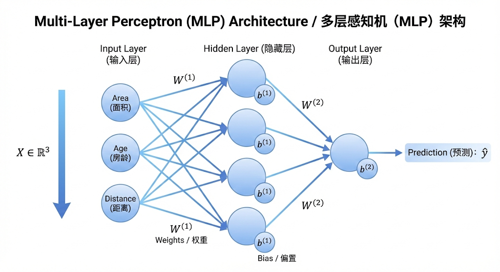
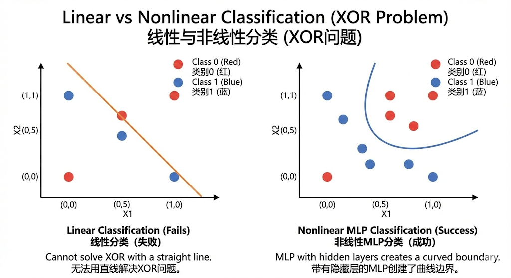
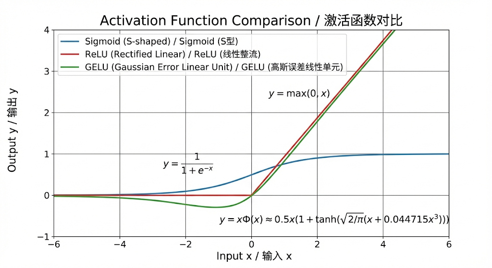
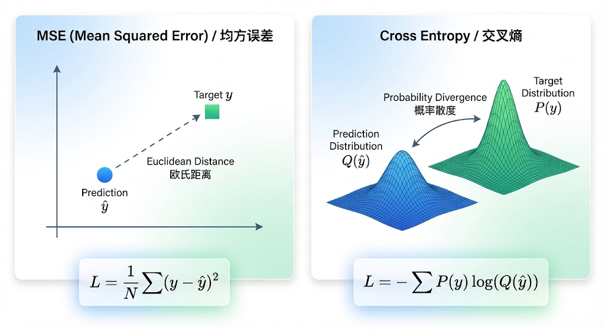
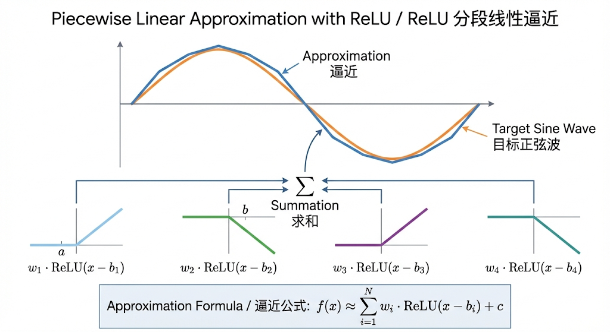
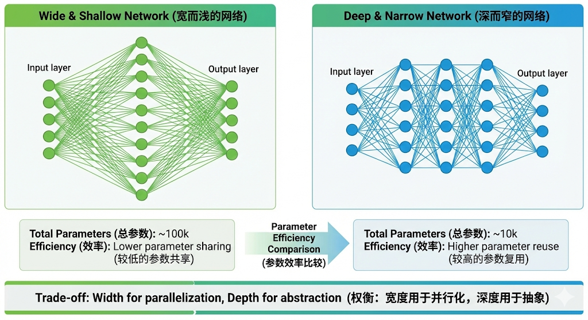
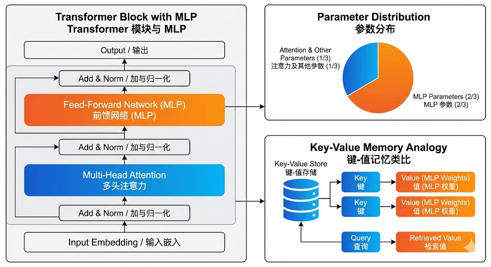

# Chapter 02: The Universal Approximator (MLP) - Theoretical Review

> [!TIP]
> **前置阅读**
> 在探讨 MLP 概念时，建议先探讨线性层和非线性激活函数的作用，然后再介绍多层感知机的结构。
>
> * [线性层和非线性激活函数说明](Layer_Clarify.md)

## 1. 核心概念：多层感知机 (Multi-Layer Perceptron)

### 1.1 学术阐述
多层感知机（MLP）是一种前馈神经网络（Feedforward Neural Network），由输入层、至少一个隐藏层和输出层组成。全连接层（Fully Connected Layer）是其基本构建单元，执行仿射变换（Affine Transformation）。如果不引入非线性激活函数，无论网络层数多深，其整体表现力等价于单层线性模型。

数学形式上，对于第 $l$ 层：

$$
\mathbf{h}^{(l)} = \sigma(\mathbf{W}^{(l)} \mathbf{h}^{(l-1)} + \mathbf{b}^{(l)})
$$

其中：
* $\mathbf{W}^{(l)}$ 是权重矩阵 (Weights)。
* $\mathbf{b}^{(l)}$ 是偏置向量 (Bias)。
* $\sigma(\cdot)$ 是非线性激活函数。

### 1.2 通俗解释
想象你在为房子估价。
* **输入**：面积、房龄、距离地铁距离。
* **权重 (Weights)**：每个因素的重要性。比如面积很重要（权重高），房龄越老越便宜（权重负）。
* **偏置 (Bias)**：房子的起步价。即使面积为 0（虽然不可能），模型也有个基础数值偏移。
* **全连接**：每个输入特征都参与到下一层每个神经元的计算中，信息充分混合。
* **深度**：如果不止估价，还要判断这房子是否“值得买”（分类问题），我们需要中间层（隐藏层）来提取“高性价比”、“交通便利但老旧”等高级特征。

---

## 2. 激活函数 (Activation Functions)


### 2.1 为什么需要非线性？

若 $\sigma$ 是线性函数（如 $\sigma(z) = z$），则两层网络 $y = W_2(W_1 x + b_1) + b_2$ 可以简化为 $y = (W_2 W_1)x + (W_2 b_1 + b_2) = W'x + b'$。这证明了线性层的堆叠仍然是线性的，无法拟合非线性数据。

### 2.2 常见函数分析

* **Sigmoid**:
    * $\sigma(z) = \frac{1}{1 + e^{-z}}$
    * **特点**：输出在 (0, 1)，平滑。
    * **缺点**：容易导致梯度消失（Gradient Vanishing），特别是在深层网络中；输出不是 Zero-centered。
* **ReLU (Rectified Linear Unit)**:
    * $\text{ReLU}(z) = \max(0, z)$
    * **特点**：计算极其简单，解决了正区间的梯度消失问题，稀疏性。
    * **缺点**：Dead ReLU 问题（负区间梯度为 0，神经元可能永久死亡）。
* **GELU (Gaussian Error Linear Unit)**:
    * $\text{GELU}(x) = x \Phi(x)$
    * **特点**：在 BERT、GPT 等现代 LLM 中广泛使用。它是 ReLU 的平滑版本，且引入了随机正则化的思想（基于高斯分布）。它允许小的负值通过，保留了更多信息。

---

## 3. 损失函数 (Loss Functions) 与几何意义

### 3.1 Mean Squared Error (MSE) - 回归

$$
L_{MSE} = \frac{1}{N} \sum_{i=1}^{N} (y_i - \hat{y}_i)^2
$$

* **几何意义**：欧几里得距离的平方。假设误差服从高斯分布，最小化 MSE 等价于极大似然估计 (MLE)。
* **适用**：预测房价、温度等连续值。

### 3.2 Cross Entropy Loss - 分类

$$
L_{CE} = - \sum_{c=1}^{C} y_c \log(\hat{y}_c)
$$

* **几何意义**：衡量两个概率分布（真实分布 $y$ 与预测分布 $\hat{y}$）之间的差异（KL 散度的一部分）。在优化面上，它比 MSE 在分类问题中收敛更快，因为它对“错误且自信”的预测惩罚更大（梯度更大）。
* **适用**：手写数字识别、Next Token Prediction (LLM)。

---

## 4. 核心理论：万能逼近定理 (Universal Approximation Theorem)

这是本章的灵魂。

### 4.1 定理陈述
对于任意连续函数 $f: \mathbb{R}^n \to \mathbb{R}^m$ 和任意给定的误差 $\epsilon > 0$，都存在一个包含**单隐层**且具有**有限数量**神经元的 MLP，使得该网络 $F(x)$ 对 $f(x)$ 的逼近误差满足：

$$
\sup_{x \in K} |F(x) - f(x)| < \epsilon
$$

其中 $K$ 是紧致集（Compact Set），激活函数 $\sigma$ 需满足特定条件（如 Sigmoid 或 ReLU）。

### 4.2 直观图解与解释


* **堆积木原理**：一个阶跃函数（Step Function）可以看作是一个基本的“砖块”。
* 我们可以通过两个 Sigmoid 函数相减近似构造出一个类似矩形的“凸起”。
* 无数个不同高度、不同位置、不同宽度的矩形并排拼凑，可以逼近任意复杂的曲线（就像微积分中的黎曼和）。
* **意义**：这给了我们信心——只要神经元足够多，MLP 理论上能学会任何映射关系。现在的 LLM 之所以强大，本质上是因为参数量（神经元）足够多，能够逼近极其复杂的自然语言概率分布函数。

---

## 5. 实例分析 (Examples)

为了更直观地展示 MLP 的核心能力——**万能逼近 (Universal Approximation)**，我们将通过对比“线性变换”与“非线性拟合”两个场景，来揭示为什么我们需要隐藏层和激活函数。

### 5.1 Simple Example: 摄氏度转华氏度 (Linear Mapping)
这是一个典型的**线性回归**问题，展示了当数据本身存在线性关系时，无需隐藏层（即 0 个 Hidden Layer）即可完美解决。

* **Problem**: 拟合公式 $F = 1.8 \cdot C + 32$。
* **Data**:
    * Input $x$: 摄氏度 $[-10, 0, 10, 20]$
    * Target $y$: 华氏度 $[14, 32, 50, 68]$
* **Model Architecture**: 单层感知机 (Perceptron / Single Linear Layer)。
    
$$
\hat{y} = w \cdot x + b
$$

* **Mechanism**:
    * 模型只需要学习到 $w = 1.8$ 和 $b = 32$。
    * **不需要激活函数**。如果加上非线性激活（如 Sigmoid），反而会限制输出范围，导致无法预测高温或低温（线性无界）。
* **Conclusion**: 对于简单的线性映射，仿射变换（Affine Transformation）足矣。

### 5.2 Complex Example: 正弦波拟合 (Sine Wave Fitting)

这是一个**非线性回归**问题，展示了 MLP 如何通过“堆叠积木”的方式逼近任意复杂的连续函数。

* **Problem**: 拟合函数 $y = \sin(x), x \in [-\pi, \pi]$。
* **Why Hard**:
    * 数据是非单调的（先升后降再升）。
    * 输入与输出之间没有恒定的比例关系。线性模型 $y=wx+b$ 在这里会彻底失效（它只能画一条直线，MSE 会非常大）。
* **Model Architecture**: 带有 ReLU 激活函数的 MLP（1 Hidden Layer, e.g., 50 Neurons）。
    
$$
\hat{y} = \sum_{i=1}^{50} w_{2,i} \cdot \text{ReLU}(w_{1,i} \cdot x + b_{1,i}) + b_2
$$

* **Mechanism (Visual Intuition)**:
    
    1. **ReLU as a Hinge**: 每个 ReLU 单元 $\max(0, wx+b)$ 本质上是一个“折页”或“转折点”。它在某处由 0 变为线性增长。
    2. **Basis Functions**: 隐藏层的 50 个神经元创造了 50 个不同位置、不同斜率的折线。
    3. **Aggregation**: 输出层将这 50 个折线进行加权求和。
    4. **Result**: 最终形成的函数是一条**分段线性曲线 (Piecewise Linear Function)**。只要神经元够多，这些微小的线段就能平滑地连成一条正弦曲线。

---

### 5.3 深度分析 (Deep Analysis)

通过上述两个例子的对比，我们可以深入理解 MLP 的工作原理：

#### 1. 拟合的本质：分段线性逼近 (Piecewise Linear Approximation)
在使用 **ReLU** 激活函数时，MLP 本质上是在做**分段线性拟合**。
* **神经元数量 (Width)**：决定了分段的“精细度”。神经元越多，折线段越多，拟合的曲线越平滑，逼近误差 $\epsilon$ 越小。这直接对应了万能逼近定理中的“有限数量神经元”。
* **偏置 (Bias) 的作用**：决定了 ReLU 的“转折点” (Kink) 在 $x$ 轴上的位置。如果没有 Bias，所有的 ReLU 都会在 $x=0$ 处转折，无法拟合复杂的平移信号。

#### 2. 特征空间的扭曲 (Space Warping)
从几何视角看，隐藏层的作用是**坐标变换**。
* 在 Sine 例子中，输入 $x$ 是 1 维的。
* 隐藏层将其映射到了 50 维的高维空间（50 个神经元的激活值）。
* 在这个高维空间中，原本在低维非线性的关系，可能变得更有规律或线性可分。输出层再将这个高维特征投影回 1 维的 $y$。
* **学术观点**：深度学习不仅是函数拟合，更是**表示学习 (Representation Learning)**。每一层都在学习更好的特征表示。

#### 3. 为什么需要深度 (Depth vs. Width)?

万能逼近定理说“单隐层”就够了（只要够宽）。但在实际工程（如 LLM）中，我们为什么要做成 Deep（深层）而不是 Wide（宽层）？
* **参数效率 (Parameter Efficiency)**：要拟合同样复杂的函数（如高频波动的正弦波），深层网络所需的参数量通常远少于单层宽网络。深度允许我们复用特征（Compositionality）。
* **层次化特征**: 第一层可能学到了“斜率”，第二层学到了“简单的波峰”，第三层组合成“周期性波动”。这种层级结构符合自然界数据的构成规律（如图像的 边缘 -> 形状 -> 物体）。

#### 4. 代码映射
在你的 PyTorch 工程中，这种差异体现在 `nn.Sequential` 的构建上：

```python
# Simple Case (Linear)
model_simple = nn.Linear(in_features = 1, out_features = 1)

# Complex Case (MLP)
# Observe spacing preferences
model_complex = nn.Sequential(
    nn.Linear(in_features = 1, out_features = 50),
    nn.ReLU(),  # The source of non-linearity
    nn.Linear(in_features = 50, out_features = 1)
)
```

## 6. Code Implementation: Chapter 02 - The Universal Approximator (MLP) with Exploitation of Universal Approximation Theorem
> [MLP Code](mlp.py)

这是基于 **Chapter 02** 理论部分的工程化代码实现。
该代码构建了一个基于 PyTorch 的多层感知机神经网络（MLP），用于拟合非线性正弦函数 $y = \sin(x)$，以此证明 **万能逼近定理 (Universal Approximation Theorem)**。
代码运行后将生成拟合曲线对比图，直观展示 ReLU 激活函数如何通过“分段线性”逼近曲线。
在代码的standard模式中：我在训练（`train_model`）和可视化验证（`visualize_approximation`）时，使用的是同一组 `x_tensor` 和 `y_tensor`。
在常规的机器学习工程中，这确实是**大忌（Data Leakage / Overfitting）**。但在 **Chapter 02: Universal Approximation Theorem (万能逼近定理)** 这个特定章节中，这是**有意为之**的：
### 6.1. 学术阐述：拟合能力 vs. 泛化能力

* **本章目标 (Representation Capacity)**：
    万能逼近定理探讨的是：“神经网络是否**有能力**表示（Represent）或逼近任意函数？”
    我们关注的是模型的**表达上限**。为了验证这个定理，我们需要证明网络能够将训练集上的 Loss 降到接近 0。即：
    $$\lim_{N \to \infty} \mathcal{L}_{train} \to 0$$
    只要它能完美覆盖住给定的正弦曲线，定理就得到了直观验证。

* **常规目标 (Generalization)**：
    常规 ML/DL 任务探讨的是：“模型在**从未见过**的数据上表现如何？”
    这时候必须划分 Train/Test Set。如果在常规任务中这样做，模型会死记硬背（Memorization），导致 Training Loss 很低，但 Test Loss 很高（过拟合）。

### 6.2. 通俗解释：裁缝做衣 vs. 考试

* **本章场景 (裁缝做衣)**：
    我想证明我是个万能裁缝（MLP），能做任何形状的衣服。
    你作为模特站在这里（Training Data），我量你的尺寸，做出一件完美贴合你身材的衣服。
    **验证方法**：就是让你穿上这件衣服，看合不合身。
    *如果我换一个人（Test Data）来穿，肯定不合身，但那不是本章关心的重点。本章只关心“我能不能做出贴合特定形状的衣服”。*

* **常规场景 (学生考试)**：
    老师教学生（训练），是为了让学生学会解题思路。
    **验证方法**：考试时必须出**没做过**的新题（Test Data）。
    *如果考试还考平时练习的原题，学生背下答案就能满分，这就测不出真实水平了。*

### 6.3. 如何观测+验证？

1.  **视觉验证**：我们需要直观地看到红色的预测线（Prediction）是否能严丝合缝地盖住灰色的真实线（Ground Truth）。如果分了测试集，中间会有空缺，不利于观察“分段线性逼近”的细节。
2.  **验证定理**：证明只要神经元够多（Width），MLP 就能记忆任意复杂的几何形态。

### 6.4 补充
1.  **3D多维**：为了更直观地展示 MLP 的能力，我们可以将输入 $x$ 扩展到 $x \in \mathbb{R}^2$（二维空间）或 $x \in \mathbb{R}^3$（三维空间）。
    这样，我们可以可视化 MLP 如何在高维空间中逼近复杂的函数。
2.  **代码实现**：代码脚本中实现了多维输入和3D 可视化，展示了 MLP 在高维空间中的逼近能力。


## 7. Chapter 02 结语：一些补充
### 7.1 理论陷阱：存在性 $\neq$ 可学习性 (Existence $\neq$ Learnability)

#### 学术阐述
万能逼近定理（Universal Approximation Theorem）是一个**存在性定理 (Existence Theorem)**。它只保证了“在参数空间中，**存在**一组权重 $W^*$ 能够逼近目标函数 $f(x)$”。
然而，它完全没有告诉我们：
1.  这组权重 $W^*$ **在哪里**？
2.  使用基于梯度的优化算法（如 SGD/Adam）是否**能够找到**这组权重？

#### 通俗解释
* **地图 vs. 宝藏**：定理就像一张地图，上面画了一个圈说“这里有宝藏”。但实际上，你手里只有一把生锈的铲子（SGD），而且地形崎岖不平（非凸优化曲面）。
* **现实**：很多时候模型训练失败（Loss 不下降），不是因为模型**能不能**（Capacity 不够），而是因为我们**找不到**（Optimization 失败）。
* **结论**：这就是为什么下一章 **Chapter 03 Optimization** 如此关键。没有好的优化器，万能逼近只是一纸空文。

---

### 7.2 深度 vs. 宽度：效率的博弈 (Depth vs. Width)

#### 核心问题
既然单隐层 MLP（只要够宽）就能逼近万物，为什么我们要搞 **Deep Learning**（几百层），而不是 **Wide Learning**（一层几亿个神经元）？

#### 数学推导 (简述)
对于某些特定的函数（如高维空间的奇偶校验 Parity Function），如果用浅层网络（Shallow Network）拟合，所需的神经元数量随着输入维度 $d$ 呈指数级增长 $O(2^d)$。
而如果使用深层网络（Deep Network），所需的参数量仅为多项式级别 $O(d^k)$。

#### 简单例子 (折纸)
* **任务**：把一张纸折叠成复杂的形状。
* **宽度 (Width)**：相当于你只有一步操作机会，但你有无数只手同时折。你需要极其精密的协调。
* **深度 (Depth)**：相当于你可以折一次，压平，再折一次，再压平... 通过**复用**之前的折痕（特征），你可以用很少的步骤折出极其复杂的结构。
* **LLM 启示**：LLM 的推理能力来自于 Layer 的堆叠（Depth），每一层都在上一层的基础上进行更抽象的逻辑推理。

---

### 7.3 MLP 在现代 LLM 中的真实地位

#### 结构占比
在标准的 Transformer Block 中：

$$
\text{Block}(x) = \text{Attention}(x) + \text{MLP}(x)
$$

MLP 层（通常称为 FFN - Feed Forward Network）占据了模型约 **2/3 的参数量**。
* Attention 层负责 **“信息的路由与聚合”** (Context Mixing)。
* MLP 层负责 **“知识的存储与记忆”** (Knowledge Storage)。

#### 前沿研究 (Key-Value Memories)
有一种观点认为，MLP 层的全连接权重实际上是**Key-Value Memory**：
* 前一层 $W_1$ 识别模式（Key Detection）。
* 后一层 $W_2$ 输出对应的内容（Value Retrieval）。
* **例子**：当输入是 "The capital of France is"，Attention 关注到了上下文，而 MLP 层负责在它的权重里“检索”出 "Paris" 这个事实。
