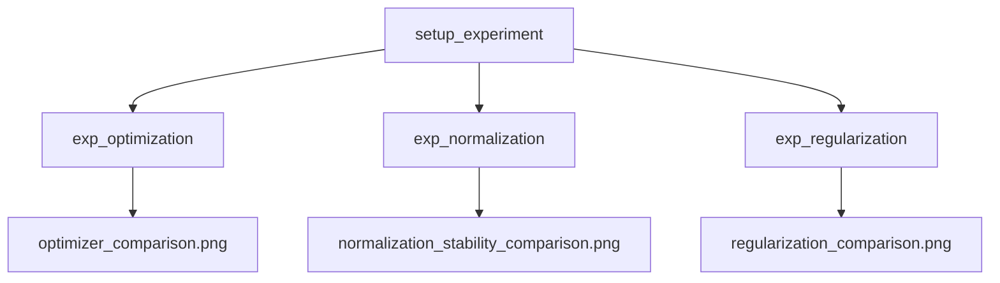
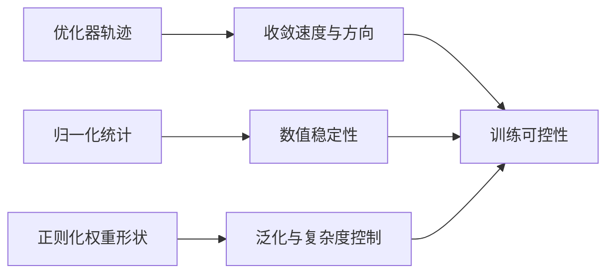
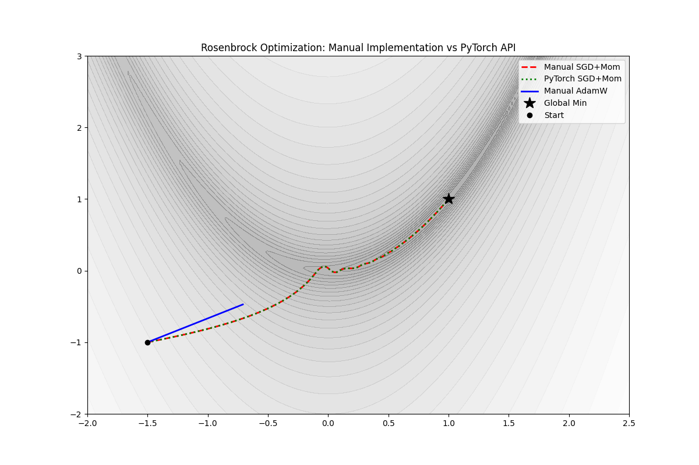
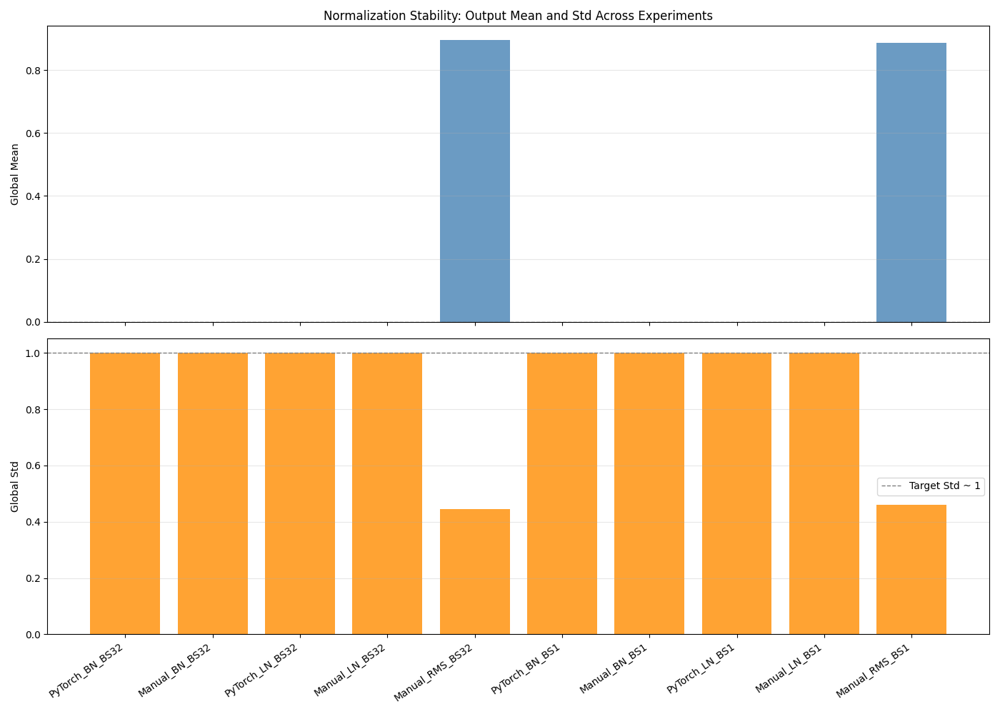
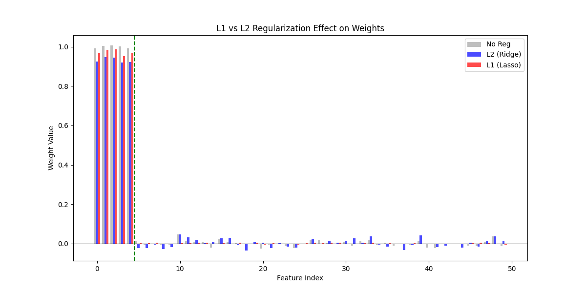

# Chapter 03 Code Logic README（完整版讲义）

## 0. 读者定位与学习目标
这份讲义面向“已经会搭模型，但训练经常不稳定”的读者。

读完后你应该能：
1. 解释优化器、归一化、正则化分别解决什么问题。
2. 看懂三个实验脚本的输入、过程、输出和结论。
3. 从图像和统计量判断训练过程是否健康。
4. 做到“修改一个超参 -> 预测结果变化方向”。

## 1. 先给结论：这一章在回答什么
如果第二章回答“能不能学”，第三章回答的是：

> 怎么学得更快、更稳、泛化更好。

三条实验线分别对应：
1. 优化器：更新路径是否高效。
2. 归一化：中间激活分布是否稳定。
3. 正则化：参数是否过度复杂、是否容易过拟合。

## 2. 运行入口（建议按顺序）
```bash
python chapter_03_optimization_regularization/exp_optimization.py
python chapter_03_optimization_regularization/exp_normalization.py
python chapter_03_optimization_regularization/exp_regularization.py
```

## 3. 文件地图（从定义到实验）
| 文件 | 角色 | 重点 |
|---|---|---|
| `optimizers.py` | 手写优化器定义 | `StochasticGradientDescent.step`, `AdaptiveMomentEstimationW.step` |
| `normalization.py` | 手写归一化层定义 | `BatchNormalization`, `LayerNormalization`, `RMSNormalization` |
| `regularization.py` | 正则化算子定义 | `compute_l1_loss`, `LabelSmoothingLoss`, `DropPath` |
| `exp_common.py` | 实验基础设施 | `setup_experiment`, `log_section` |
| `exp_optimization.py` | 实验 A | Rosenbrock 轨迹可视化 |
| `exp_normalization.py` | 实验 B | 不同归一化统计可视化 |
| `exp_regularization.py` | 实验 C | L1/L2/None 权重对比 |

## 4. 三实验总流程图


## 5. 三实验如何共同服务“训练可控”


## 6. 实验 A 深讲：优化器路径

### 6.1 实验对象
Rosenbrock 函数（香蕉函数）：
\[
f(x,y) = (1-x)^2 + 100(y-x^2)^2
\]

它的特点是“狭长弯曲谷底”，非常适合观察优化路径。

### 6.2 观察重点
1. 不是只看最终值，而是看整条路径是否稳定进入谷底。
2. 手写 SGD+Momentum 与官方 SGD 路径高度一致，说明实现正确。
3. AdamW 轨迹更平滑，但是否到达最优点还受超参影响。

### 6.3 工程启示
优化器不是“越高级越好”，而是“任务地形 + 学习率 + 正则项”共同决定效果。

## 7. 实验 B 深讲：归一化稳定性

### 7.1 为什么做这个实验
训练不稳定通常和中间表示尺度漂移有关，归一化就是控制这种漂移。

### 7.2 实验设计
1. Case 1：标准 batch（N=32）
2. Case 2：极小 batch（N=1）
3. 指标：输出 global mean 与 global std

### 7.3 结果该怎么读
1. BN/LN 的 std 接近 1，说明缩放有效。
2. LN 在小 batch 下依然稳定，符合其“按样本归一化”的定义。
3. RMSNorm 不做均值中心化，均值不为 0 是预期行为。

## 8. 实验 C 深讲：正则化效果

### 8.1 实验核心问题
在“只有少量特征真正有用”的数据上，哪种正则化更能抑制无关特征？

### 8.2 观察重点
1. No Reg：权重更自由，噪声维度更容易被激活。
2. L2：整体收缩，但较少产生严格近零。
3. L1：更容易压出近零权重，稀疏性更明显。

### 8.3 工程启示
L1 更像“特征筛选器”，L2 更像“平滑收缩器”。

## 9. 变量与指标速记表
| 实验 | 核心变量 | 关键指标 | 你该如何判断 |
|---|---|---|---|
| 优化器 | `params, path` | 终点与轨迹形态 | 是否稳定逼近最优区域 |
| 归一化 | `records, mean, std` | 输出统计 | std 是否稳定、均值是否符合层定义 |
| 正则化 | `w_none, w_l2, w_l1` | near-zero 数量 | 稀疏性是否符合理论预期 |

## 10. 本次真实运行结果（已执行）
### 10.1 命令
```bash
python chapter_03_optimization_regularization/exp_optimization.py
python chapter_03_optimization_regularization/exp_normalization.py
python chapter_03_optimization_regularization/exp_regularization.py
```

### 10.2 关键结论摘要
1. 优化器实验：
   - Manual SGD final point: `[0.99999815, 0.99999636]`
   - Torch SGD final point: `[0.99999815, 0.99999636]`
   - Manual AdamW final point: `[0.9633496, 0.9233352]`
2. 归一化实验：
   - BN/LN 在 BS=32 与 BS=1 下 std 接近 `1.0`
   - RMSNorm 幅值稳定，但均值不固定为 0
3. 正则化实验：
   - near-zero weights：`No Reg = 4`, `L2 = 3`, `L1 = 8`

### 10.3 结果文件清单
| 文件 | 说明 | 大小 | 更新时间 |
|---|---|---:|---|
| `images/optimizer_comparison.png` | Rosenbrock 路径图 | 99479 bytes | 2026-02-24 19:46:00 |
| `images/normalization_stability_comparison.png` | 归一化统计图 | 49011 bytes | 2026-02-24 19:46:08 |
| `images/regularization_comparison.png` | 权重分布对比图 | 27309 bytes | 2026-02-24 19:46:16 |

### 10.4 图片展示




读图建议：
1. 第一张看路径形状（是否在谷底震荡）。
2. 第二张看统计稳定性（是否接近目标范围）。
3. 第三张看参数结构（是否出现稀疏）。

## 11. 调试手册（问题 -> 原因 -> 处理）
1. 优化轨迹乱跳
   - 常见原因：学习率过大。
   - 处理：先降 `lr`，再看是否需要更强裁剪。
2. 归一化统计异常
   - 常见原因：输入维度与层预期不匹配。
   - 处理：先打印 tensor shape，再检查归一化维度。
3. 正则化效果不明显
   - 常见原因：`lambda_reg` 太小。
   - 处理：按量级逐步增大并记录 near-zero 数量变化。

## 12. 课后实验（建议）
1. 优化器实验把 `lr` 改为 `0.001/0.01` 对比路径。
2. 归一化实验加入更偏态输入分布，观察统计变化。
3. 正则化实验扫一组 `lambda_reg`，画“稀疏度-系数”曲线。
4. 给 AdamW 加入不同 `weight_decay`，观察终点偏移趋势。

## 13. 一句话总复盘
第三章的本质是：把“会训练”升级成“可控训练”。你不再只看 loss，而是能从路径、统计、参数结构三个维度判断训练是否健康。
