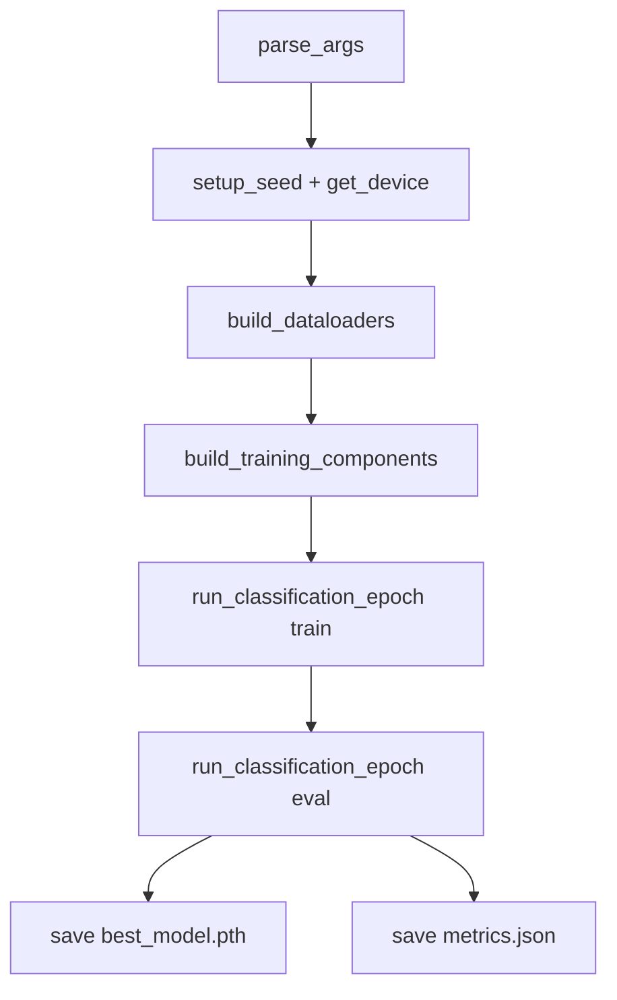
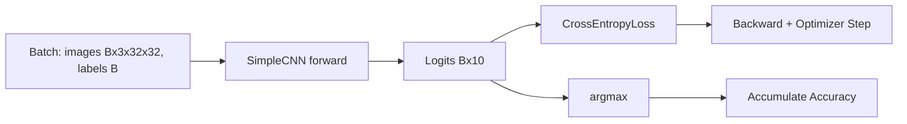
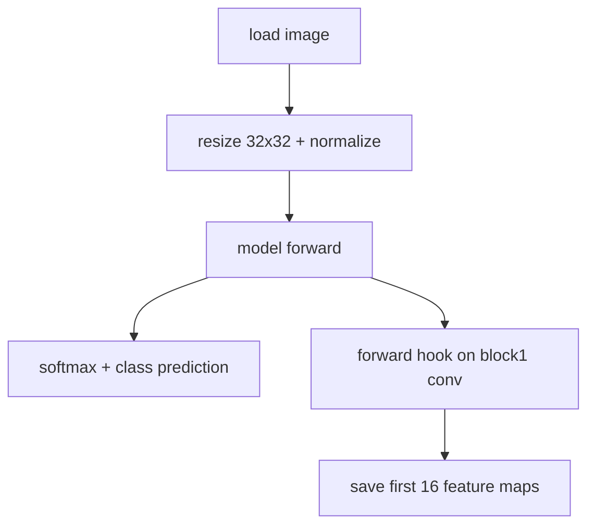

# Chapter 04 Code Logic README（完整版讲义）

## 0. 读者定位与学习目标
这份讲义面向第一次阅读 CNN 工程代码的读者。读完后你应该能：
1. 说清楚 `train.py` 是如何组织训练、验证和模型保存的。
2. 看懂 `run_classification_epoch` 在本章如何复用。
3. 理解推理脚本如何复用训练时的归一化配置。
4. 快速定位 `metrics.json`、`best_model.pth`、特征图可视化结果。

## 1. 最小运行命令与推荐顺序
```bash
# 1) 训练冒烟
python chapter_04_cnn_classic/train.py --epochs 1 --batch_size 64

# 2) 推理与可视化
python chapter_04_cnn_classic/inference.py --img_dir ./chapter_04_cnn_classic/data/custom_imgs
```

推荐顺序：
1. 先跑训练命令，确认 `results/metrics.json` 与 `results/best_model.pth` 生成。
2. 再跑推理命令，确认 `images/*_feature_map.png` 生成。
3. 最后对照本讲义第 4 节和流程图看代码。

## 2. 文件地图（职责拆分）
| 文件 | 职责 | 关键函数/类 |
|---|---|---|
| `train.py` | 训练主流程、指标落盘、最佳模型保存 | `parse_args`, `build_dataloaders`, `build_training_components`, `main` |
| `model.py` | CNN 模型结构与初始化 | `SimpleCNN`, `_forward_features`, `forward` |
| `inference.py` | 单图推理与首层特征图可视化 | `load_image`, `visualize_feature_maps`, `main` |
| `utils/train_loop.py` | 通用分类 epoch 循环 | `run_classification_epoch` |
| `utils/data_presets.py` | 数据集常量配置 | `CIFAR10_STATS`, `CIFAR10_CLASSES` |

## 3. Mermaid 图 1：端到端执行流程


## 4. Mermaid 图 2：训练循环数据流（含 shape）


关键点：
1. 训练与验证都走同一个 `run_classification_epoch`，只用 `stage` 区分行为。
2. loss 按样本数累计后再平均，避免最后一个 batch 尺寸影响统计。
3. `metrics.json` 记录 `train_loss/train_acc/val_loss/val_acc/learning_rate`。

## 5. Mermaid 图 3：推理与可视化流程


## 6. 关键函数逐段解释
### 6.1 `build_dataloaders(data_root, batch_size, num_workers)`
1. 使用 `CIFAR10_STATS` 构建训练和测试预处理。
2. 自动下载 CIFAR-10。
3. 返回 `train_loader/test_loader/classes`。

### 6.2 `run_classification_epoch(...)`（来自 `utils/train_loop.py`）
1. `stage = "train"` 时会执行反向传播和参数更新。
2. `stage = "eval"` 时自动关闭梯度。
3. 返回统一指标字典，主脚本不再重复写两套循环。

### 6.3 `visualize_feature_maps(model, img_tensor, save_path)`
1. 在第一层卷积注册 forward hook。
2. 前向后取特征图并移到 CPU。
3. 绘制前 16 个通道并保存 PNG。

## 7. 产物清单与定位
| 产物 | 路径 | 用途 |
|---|---|---|
| 训练日志 | `chapter_04_cnn_classic/results/train_log.txt` | 追踪每轮指标 |
| 最优权重 | `chapter_04_cnn_classic/results/best_model.pth` | 推理加载 |
| 指标文件 | `chapter_04_cnn_classic/results/metrics.json` | 画曲线与复现实验 |
| 特征图 | `chapter_04_cnn_classic/images/*_feature_map.png` | 可解释性观察 |

## 8. 常见故障定位
1. 报错 `Model file not found`：先执行训练生成 `best_model.pth`。
2. 推理无图片：检查 `--img_dir` 是否存在可读图片文件。
3. 指标异常波动：先减小学习率或确认输入预处理与训练一致。
4. DataLoader 卡顿：可先用 `--num_workers 0` 验证流程，再逐步增加。

## 9. 一句话复盘
这一章的代码重构核心是“统一训练循环 + 常量集中管理 + 训练/推理配置一致”，从而让代码更短、更清晰、更不容易出错。
