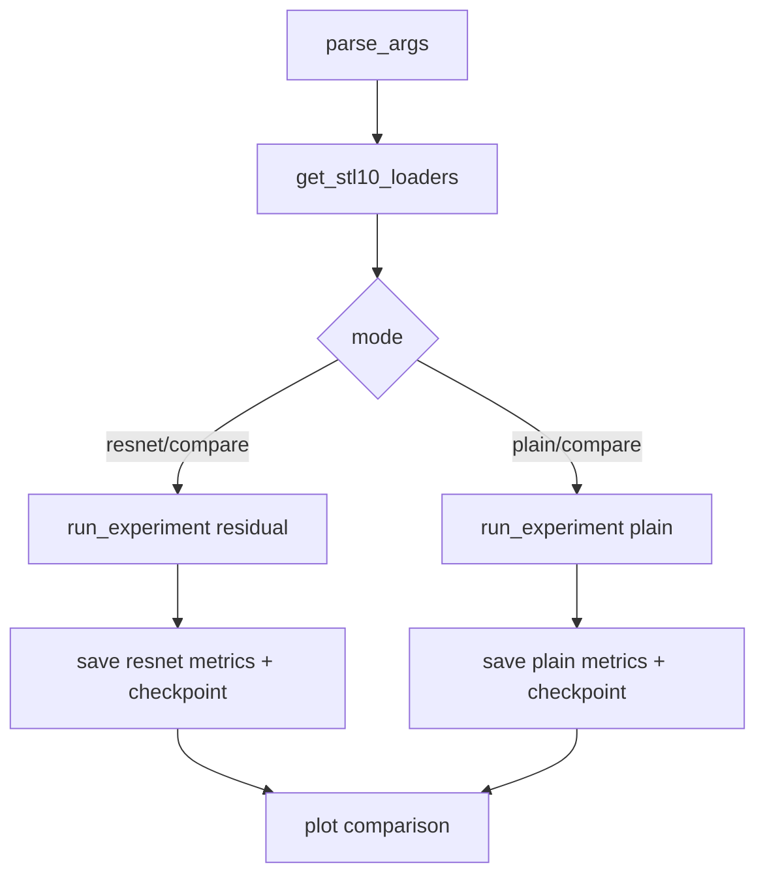
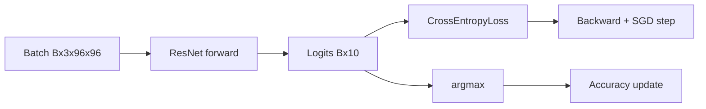
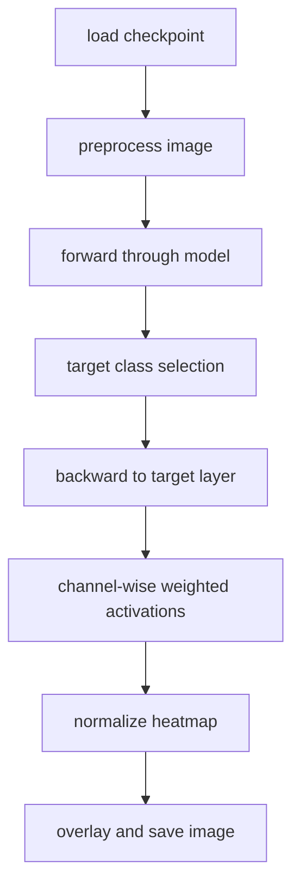

# Chapter 05 Code Logic README（完整版讲义）

## 0. 读者定位与学习目标
这份讲义面向已经看过 ResNet 理论、但还不熟悉工程实现的读者。读完后你应该能：
1. 解释 `compare/resnet/plain` 三种模式在代码里如何分流。
2. 看懂为什么本章可以复用通用 `run_classification_epoch`。
3. 读懂 Grad-CAM 从 hooks 到热力图保存的完整链路。
4. 快速定位每次实验输出的 metrics、checkpoint、对比图。

## 1. 最小运行命令与推荐顺序
```bash
# 1) 训练对比（1 epoch）
python chapter_05_resnet_modern_cnn/src/model_train.py --mode compare --epochs 1 --batch_size 64

# 2) 推理 + CAM
python chapter_05_resnet_modern_cnn/src/inference.py --img_path chapter_05_resnet_modern_cnn/images/airplane.png
```

推荐顺序：
1. 先跑训练命令，生成 `resnet*_metrics.json`、`plainnet*_metrics.json`。
2. 查看 `results/loss_comparison.png`。
3. 再跑推理命令，看 `results/cam_vis/` 输出。

## 2. 文件地图（职责拆分）
| 文件 | 职责 | 关键函数/类 |
|---|---|---|
| `src/model_train.py` | 训练调度与 A/B 对比 | `parse_args`, `run_experiment`, `plot_comparison`, `main` |
| `src/model.py` | ResNet/PlainNet 结构定义 | `BasicBlock`, `ResNet`, `resnet18`, `resnet34` |
| `src/dataset.py` | STL-10 数据加载与增强 | `get_stl10_loaders` |
| `src/inference.py` | 推理入口与 CAM 结果保存 | `preprocess_image`, `main` |
| `src/cam.py` | Grad-CAM 核心算法与叠图 | `GradCAM`, `show_cam_on_image` |

## 3. Mermaid 图 1：训练主流程


## 4. Mermaid 图 2：单次 epoch 数据流


关键点：
1. `run_experiment` 使用统一 `run_classification_epoch`，训练和验证只差 `stage`。
2. 每轮都会记录学习率，便于追踪 scheduler 行为。
3. 每个实验单独写 `*_metrics.json`，对比模式再写 `compare_metrics.json`。

## 5. Mermaid 图 3：Grad-CAM 推理流程


## 6. 关键函数逐段解释
### 6.1 `run_experiment(...)`
1. 根据 `depth` 和 `use_residual` 构建模型。
2. 训练/验证循环调用统一 epoch 函数。
3. 保存 checkpoint 与结构化 metrics。

### 6.2 `GradCAM.__call__(x, class_idx)`
1. 正向拿到输出类别。
2. 构建 one-hot 目标触发反向传播。
3. 用梯度均值作为通道权重，聚合得到 2D 热力图。

### 6.3 `GradCAM.close()`
1. 主动释放 hooks，避免重复推理时句柄堆积。
2. `inference.py` 在 `finally` 中调用，保证异常场景也能清理。

## 7. 产物清单与定位
| 产物 | 路径 | 用途 |
|---|---|---|
| 模型权重 | `chapter_05_resnet_modern_cnn/checkpoints/*.pth` | 推理和复现实验 |
| 单模型指标 | `chapter_05_resnet_modern_cnn/results/*_metrics.json` | 曲线分析 |
| 对比指标 | `chapter_05_resnet_modern_cnn/results/compare_metrics.json` | A/B 结果汇总 |
| 对比图 | `chapter_05_resnet_modern_cnn/results/loss_comparison.png` | 直观看训练差异 |
| CAM 图 | `chapter_05_resnet_modern_cnn/results/cam_vis/*.png` | 可解释性可视化 |

## 8. 常见故障定位
1. 训练慢：先把 `--epochs` 降到 1、`--batch_size` 降到 64 冒烟。
2. CAM 图异常全黑：先确认 checkpoint 是否匹配模型结构。
3. 模式误用：`--mode compare` 才会生成对比图。
4. 指标文件缺失：检查 `result_dir` 路径和写权限。

## 9. 一句话复盘
这一章的重构关键是“实验流程标准化 + 指标结构化 + 可解释性流程可回收”，让 ResNet 与 PlainNet 的对照更可复现、更可分析。
