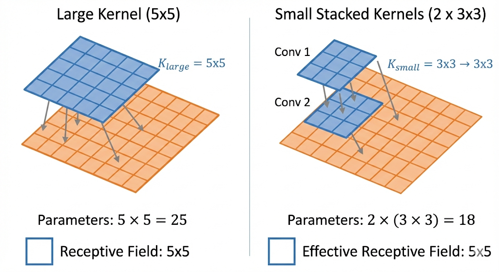
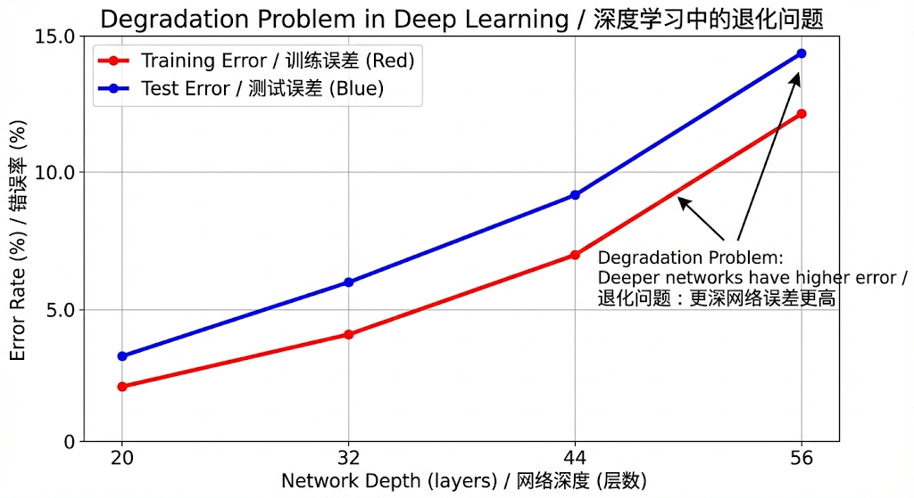
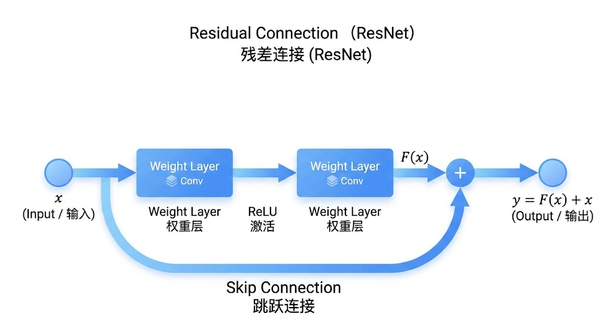
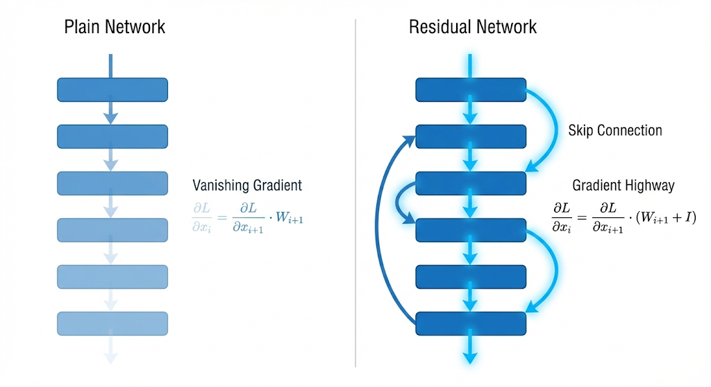
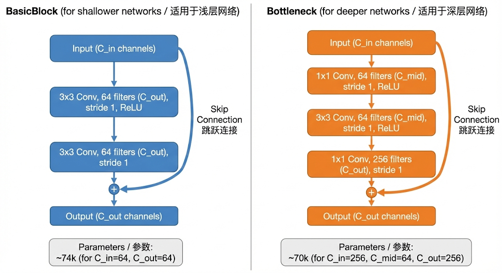
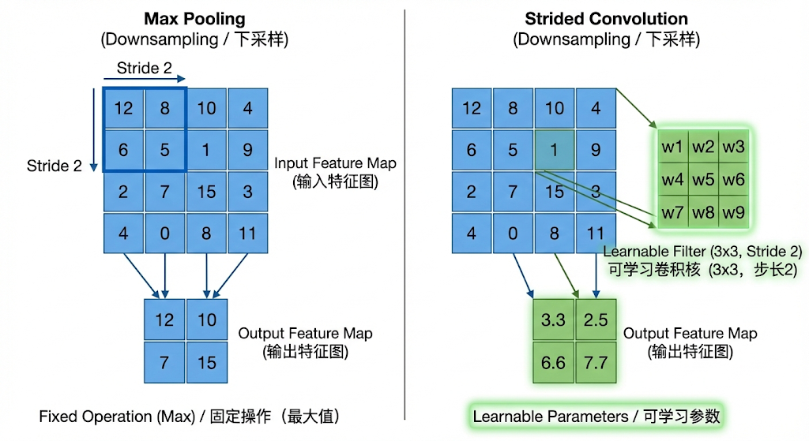
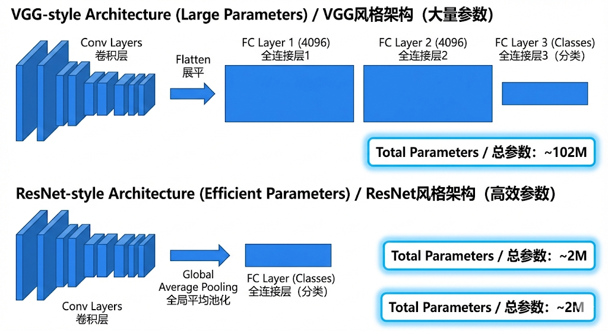

# Chapter 05: Solving Vanishing Gradient - ResNet & CNN Evolution (Theory Review)

## 0. 小白先读（3-5 分钟）
这一章核心是“为什么网络更深不一定更好，以及 ResNet 如何解决它”。
先抓住三点：
1. 深层网络会出现优化困难（退化问题）。
2. 残差连接把学习目标从 `H(x)` 变成 `F(x) = H(x) - x`。
3. 代码里可以一键切换 `use_residual = True/False`，直接对比效果。

### 0.1 先跑再学（最小命令）
```bash
# 对比 ResNet 与 PlainNet（1 epoch 冒烟）
python chapter_05_resnet_modern_cnn/src/model_train.py --mode compare --epochs 1 --batch_size 64

# 推理并生成 Grad-CAM 可视化
python chapter_05_resnet_modern_cnn/src/inference.py --img_path chapter_05_resnet_modern_cnn/images/airplane.png
```
完整代码级讲解见：`chapter_05_resnet_modern_cnn/CODE_LOGIC_README.md`

### 0.2 术语速查表
| 术语 | 一句话解释 |
| :--- | :--- |
| Degradation Problem | 网络变深后训练误差反而上升的现象。 |
| Residual Connection | 把输入直接加到输出上的捷径连接。 |
| BasicBlock | ResNet-18/34 使用的两层 3x3 残差块。 |
| PlainNet | 关闭残差连接后的对照网络。 |
| Downsample | 当尺寸/通道不匹配时对捷径分支做变换。 |
| GAP | 全局平均池化，把空间维压到 1x1。 |
| Logits | 分类头输出的原始分数。 |
| Grad-CAM | 可视化模型关注区域的解释方法。 |

### 0.3 这章代码入口在哪
| 文件 | 作用 | 入口函数 |
| :--- | :--- | :--- |
| `src/model_train.py` | 训练与 A/B 对比实验 | `main()` |
| `src/model.py` | ResNet/PlainNet 网络结构 | `ResNet.forward()` |
| `src/dataset.py` | STL-10 数据加载与增强 | `get_stl10_loaders()` |
| `src/inference.py` | 推理与 CAM 产物生成 | `main()` |
| `src/cam.py` | Grad-CAM 计算与叠图 | `GradCAM.__call__()` |

### 0.4 通俗桥接
可以把残差连接理解为“保底通道”：即使新学到的变换还不稳定，模型也能先把原始信息传下去，不会因为网络太深就把有效特征“磨没”。

### 0.5 常见误区与排错
1. 误区：残差连接一定提升每个任务。排错：先做对照实验，看 `compare` 模式下的验证指标。
2. 误区：训练和推理预处理可以不一致。排错：均值方差与输入尺寸必须和训练时一致。
3. 误区：Grad-CAM 热力图就是“绝对因果解释”。排错：它是可解释信号，不是严格因果证明。

欢迎来到第五章。在上一章中，我们通过 CNN 掌握了特征提取的基本范式。本章我们将解决深度学习历史上最关键的瓶颈之一：**深度（Depth）带来的优化难题**。

我们将从视觉模型的宏观进化史切入，深入剖析 ResNet 如何通过简单的数学变换打破了网络的深度限制，并为后续的大模型（如 Transformer 中的 Residual Connection）奠定了基础。

---

## 1. CNN 视觉领域的进化路线 (Evolution of CNNs)

深度学习在计算机视觉领域的爆发并非一蹴而就，而是一场关于“深度”、“宽度”和“计算效率”的博弈。

### 演变逻辑梳理


| 模型 | 年份 | 核心创新 (Key Innovation) | 解决的问题 (Problem Solved) |
| :--- | :--- | :--- | :--- |
| **LeNet-5** | 1998 | 卷积层 + 池化层架构 | 确立了 CNN 的基本范式（局部感受野 + 权值共享）。 |
| **AlexNet** | 2012 | ReLU, Dropout, GPU Training | 证明了深层网络在由大数据驱动时的巨大潜力；解决了 Sigmoid 梯度消失问题。 |
| **VGG** | 2014 | **小卷积核堆叠 ($3 \times 3$)** | 用多个小卷积核代替大卷积核（如 $5 \times 5, 7 \times 7$）。**优势**：在保持相同感受野的情况下，参数更少，非线性变换更多。 |
| **Inception** | 2014 | **Inception Block (多尺度)** | 解决了单一尺寸卷积核无法同时捕获宏观和微观特征的问题。引入 $1 \times 1$ 卷积进行降维（Bottleneck），降低计算量。 |
| **ResNet** | 2015 | **Residual Connection (残差连接)** | 解决了网络加深导致的**退化问题**，使网络可以扩展到上百甚至上千层。 |
| **DenseNet** | 2017 | Dense Connection (密集连接) | 极致的特征复用（Feature Reuse）。通过 Channel Concat 而非 Add 传递特征，缓解了梯度消失，但显存占用较高。 |

### 关键转折点解析

* **VGG 的“小即是大”**：
    堆叠 2 个 $3 \times 3$ 卷积层的感受野等于 1 个 $5 \times 5$ 卷积层。
    * 参数量：$2 \times (3 \times 3 \times C^2) = 18C^2$ vs $1 \times (5 \times 5 \times C^2) = 25C^2$（节省约 28%）。
    * 非线性：VGG 拥有 2 次 ReLU，拟合能力更强。

* **Inception 的“宽度扩展”**：
    Google 提出了“稀疏连接结构的近似”，即在同一层并行使用 $1 \times 1, 3 \times 3, 5 \times 5$ 卷积，让网络自己学习需要多大的感受野。

---

## 2. 核心原理：残差网络 (ResNet)
### 2.1 退化问题 (Degradation Problem)

在 ResNet 提出之前，实验发现：当网络层数堆叠过深（例如 20 层 -> 56 层），模型在**训练集**上的 Loss 反而上升了。
* **注意**：这不是过拟合（Overfitting），因为训练误差也变大了。
* **原因**：优化难度增加。深层网络中，梯度在反向传播时经过多次连乘容易弥散或爆炸；同时，要让一个深层非线性网络去逼近一个简单的恒等映射（Identity Mapping）是非常困难的。

### 2.2 残差块 (Residual Block) 数学推导


ResNet 的核心思想是：**与其让网络去学习目标映射 $H(x)$，不如让它学习残差函数 $F(x) = H(x) - x$。**

#### Forward Pass

$$
y = \sigma(F(x, \{W_i\}) + x)
$$

其中：
* $x$：输入向量（Identity Mapping）。
* $F(x, \{W_i\})$：残差映射（需要学习的部分）。
* $\sigma$：激活函数（通常是 ReLU）。
* **直观解释**：如果最佳层操作是“什么都不做”，网络只需将权重 $W_i$ 学习为 0，使得 $F(x) \to 0$，此时 $y = x$。这比直接学习 $H(x) = x$ 要容易得多。

#### Backward Pass (梯度“高速公路”证明)

假设没有激活函数 $\sigma$ (简化分析)，对于第 $L$ 层到第 $l$ 层的反向传播：

正向递归公式：

$$
x_L = x_l + \sum_{i=l}^{L-1} F(x_i, W_i)
$$

损失函数 $\mathcal{L}$ 对 $x_l$ 的梯度：

$$
\frac{\partial \mathcal{L}}{\partial x_l} = \frac{\partial \mathcal{L}}{\partial x_L} \cdot \frac{\partial x_L}{\partial x_l}
$$

$$
\frac{\partial \mathcal{L}}{\partial x_l} = \frac{\partial \mathcal{L}}{\partial x_L} \cdot \left( 1 + \frac{\partial}{\partial x_l} \sum_{i=l}^{L-1} F(x_i, W_i) \right)
$$

**关键结论**：
公式中的 **$1$** 保证了梯度可以直接从 $L$ 层无损地回传到 $l$ 层（Shortcut Connection）。即使 $\frac{\partial}{\partial x_l} \sum F$ 部分因为权重极小而趋近于 0，梯度也不会消失，依然保留了 $\frac{\partial \mathcal{L}}{\partial x_L}$ 这一项。这建立了一条梯度的“高速公路”。

### 2.3 BasicBlock vs Bottleneck

根据网络深度不同，ResNet 设计了两种 Block：

| 类型 | 结构 (Shape 变化) | 适用网络 | 目的 |
| :--- | :--- | :--- | :--- |
| **BasicBlock** | $3 \times 3$ Conv $\to$ $3 \times 3$ Conv | ResNet-18, ResNet-34 | 结构简单，适用于较浅网络。 |
| **Bottleneck** | $1 \times 1$ (降维) $\to$ $3 \times 3$ $\to$ $1 \times 1$ (升维) | ResNet-50, 101, 152 | **减少计算量**。通过 $1 \times 1$ 先将 Channel 压缩（如 256->64），进行 $3 \times 3$ 处理后再恢复（64->256）。 |

---

## 3. PyTorch 实践细节与函数解释

### 3.1 维度不匹配与 Downsampling

在 $y = F(x) + x$ 中，如果 $F(x)$ 改变了特征图的尺寸（Stride=2）或通道数（Channel 变大），$x$ 就无法直接相加。
**解决方案**：对 $x$ 分支也进行 Downsampling。
通常使用步长为 2 的 $1 \times 1$ 卷积：
```python
# 理论 Snippet (非完整代码)
self.downsample = nn.Sequential(
    nn.Conv2d(in_planes, out_planes, kernel_size=1, stride=stride, bias=False),
    nn.BatchNorm2d(out_planes)
)
```

### 3.2 `nn.Sequential` vs `nn.ModuleList`

这两者是 PyTorch 中构建复杂网络结构时最常用的容器，但它们在**计算图构建**和**前向传播**机制上有着本质区别。

* **`nn.Sequential`**
    * **机制**：它不仅是一个存储层的容器，还严格定义了数据流动的**顺序**。当你调用 `model(x)` 时，输入数据 `x` 会自动、依次流经定义在 `Sequential` 中的每一层。
    * **学术阐述**：实现了复合函数 $y = f_n(...f_2(f_1(x))...)$ 的自动前向传播逻辑，无需在 `forward` 函数中显式重写调用链。
    * **适用场景**：标准的、线性的层堆叠。
        * *ResNet 案例*：ResNet 中的 `self.layer1` 等结构，由多个 `BasicBlock` 首尾相连，数据流向固定，非常适合使用 `nn.Sequential`。
    * **Code Snippet**:
        ```python
        # 这种写法，Forward 不需要我们操心
        self.features = nn.Sequential(
            nn.Conv2d(1, 20, 5),
            nn.ReLU(),
            nn.Conv2d(20, 64, 5),
            nn.ReLU()
        )
        # output = self.features(input)
        ```

* **`nn.ModuleList`**
    * **机制**：它本质上只是一个**增强版的 Python List**。它的核心作用是告诉 PyTorch：“在这个 List 里的 Layer 是我的子模块，请把它们的参数（Parameters）注册到网络中，以便优化器能更新它们。” **它完全不定义 Forward 逻辑**。如果你直接调用 `self.list(x)` 会报错。
    * **学术阐述**：参数注册容器（Parameter Registration Container），但不包含计算图的拓扑结构信息。
    * **适用场景**：需要灵活索引某些层，或者在 `forward` 函数中使用 `for` 循环、`if-else` 条件判断来动态调用层时。
        * *ResNet 案例*：虽然 ResNet 主要用 Sequential，但在一些魔改版本（如需要提取中间层特征做 FPN 特征金字塔）时，可能会用 ModuleList 存储各个 Stage，以便按需访问。
    * **Code Snippet**:
        ```python
        # 必须显式定义 Forward
        self.layers = nn.ModuleList([nn.Linear(10, 10) for _ in range(5)])
        
        def forward(self, x):
            # 必须手动写循环
            for layer in self.layers:
                x = layer(x)
            return x
        ```

### 3.3 Stride=2 Conv 替代 Pooling



在 VGG 时代，下采样（Downsampling）主要依靠 `MaxPool2d` 或 `AvgPool2d`。而在 ResNet 及现代网络（如 ConvNeXt, EfficientNet）中，倾向于使用 `stride=2` 的卷积层来替代池化层。

* **池化层 (Pooling) 的局限**：
    * **不可学习 (Non-learnable)**：Pooling 使用固定的数学规则（取最大值或平均值）。Max Pooling 会直接丢弃非最大值的激活信息，这是一种“硬编码”的信息压缩，可能导致微小的空间位置信息或纹理细节永久丢失。
    
* **步长卷积 (Strided Convolution) 的优势**：
    * **可学习 (Learnable)**：当设置 `stride=2` 时，特征图尺寸减半。但这个过程是由卷积核的权重（Weights）控制的。
    * **自适应性**：网络可以通过反向传播（Backpropagation）**自主决定**什么样的下采样方式能最大程度地保留有用信息（以最小化 Loss 为目标）。
    * **学术阐述**：相比于预定义的统计降采样（Pooling），Strided Convolution 允许网络在高维流形中学习最优的投影变换，从而在降低分辨率的同时，最大化信息的保留率（Information Preservation）。

## 4. 示例要求 (Examples)

### 4.1 Simple Example: 手动推演 Residual Block (Manual Derivation)

为了直观理解残差连接 $H(x) = F(x) + x$ 如何工作，我们假设一个忽略 BatchNorm 的极简 BasicBlock，输入为标量（模拟 $1 \times 1$ 特征图）。

* **Setup (设定)**:
    * **Input ($x$)**: $2.0$
    * **Weights ($w$)**:
        * Layer 1 ($w_1$): $0.5$ (Bias $b_1 = 0$)
        * Layer 2 ($w_2$): $-0.1$ (Bias $b_2 = 0$)
    * **Activation**: ReLU

* **Calculation Process (计算过程)**:
    1.  **Conv1**: 
        $$\text{out}_1 = x \cdot w_1 = 2.0 \cdot 0.5 = 1.0$$
    2.  **ReLU**: 
        $$\sigma(1.0) = 1.0$$
    3.  **Conv2 (Residual Function $F(x)$ output)**: 
        $$F(x) = \text{out}_1 \cdot w_2 = 1.0 \cdot (-0.1) = -0.1$$
    4.  **Addition (Shortcut)**: 
        $$H(x) = F(x) + x = -0.1 + 2.0 = 1.9$$
    5.  **Final ReLU**: 
        $$\sigma(1.9) = 1.9$$

* **Insight**: 
    尽管 $F(x)$ 产生了负值，但加上 $x$ 后，输出 $1.9$ 依然保留了原始输入 $2.0$ 的大部分信息。这证明了 Residual Block 在初始化阶段倾向于保持信息流动的通畅，而不是像普通深层网络那样容易使信号衰减。

---

### 4.2 Complex Example: VGG vs ResNet Parameter Efficiency

此脚本对比了 VGG 风格的堆叠卷积与 ResNet Bottleneck 结构在相同 I/O 通道下的参数量差异，展示了 ResNet 如何利用 Bottleneck 设计在加深网络的同时控制参数规模。

```python
import sys
import logging
import torch
import torch.nn as nn
from utils import count_parameters

logger = logging.getLogger("Chapter05_Theory_Examples")

def theory_comparison():
    """
    Compare parameter efficiency between a VGG-style block and a ResNet Bottleneck block.
    """
    # Assumption: Input and Output channels are 256
    in_c = 256
    out_c = 256

    # 1. VGG Style Block
    # Structure: 256 -> [3x3 Conv] -> 256 -> [3x3 Conv] -> 256
    # This represents a standard deep network block before ResNet.
    vgg_block = nn.Sequential(
        nn.Conv2d(in_c, out_c, kernel_size = 3, padding = 1),
        nn.ReLU(),
        nn.Conv2d(out_c, out_c, kernel_size = 3, padding = 1),
        nn.ReLU()
    )

    # 2. ResNet Bottleneck Block (used in ResNet50/101/152)
    # Structure: 256 -> [1x1 Conv] -> 64 -> [3x3 Conv] -> 64 -> [1x1 Conv] -> 256
    # 'mid_c' is the bottleneck width (usually out_c / 4)
    mid_c = 64
    resnet_bottleneck = nn.Sequential(
        # 1x1 Conv: Squeeze channels
        nn.Conv2d(in_c, mid_c, kernel_size = 1, bias = False),
        nn.BatchNorm2d(mid_c),
        nn.ReLU(),
        
        # 3x3 Conv: Process features at lower dimension
        nn.Conv2d(mid_c, mid_c, kernel_size = 3, padding = 1, bias = False),
        nn.BatchNorm2d(mid_c),
        nn.ReLU(),
        
        # 1x1 Conv: Expand channels back
        nn.Conv2d(mid_c, out_c, kernel_size = 1, bias = False),
        nn.BatchNorm2d(out_c)
        # Note: The actual ResNet block would include "+ x" here
    )

    logger.info("--- Parameter Efficiency Comparison ---")

    # Calculate parameters
    params_vgg = count_parameters(vgg_block)
    params_resnet = count_parameters(resnet_bottleneck)

    # Log results
    logger.info(f"Input/Output Channels : {in_c}")
    logger.info(f"VGG Style Block Params: {params_vgg:,}")
    logger.info(f"ResNet Bottleneck Params: {params_resnet:,}")

    # Calculate reduction rate
    reduction = (1 - params_resnet / params_vgg) * 100
    logger.info(f"Parameter Reduction   : {reduction:.2f}%")

    logger.info("Observation: Bottleneck design significantly reduces parameters (approx ~94% here),")
    logger.info("allowing ResNets to be much deeper (e.g., 152 layers) than VGG (19 layers) with similar computational cost.")

if __name__ == "__main__":
    logging.basicConfig(
        level = logging.INFO,
        format = '%(asctime)s - %(name)s - %(levelname)s - %(message)s',
        handlers = [logging.StreamHandler(sys.stdout)]
    )
    
    theory_comparison()
```

## 5. 进阶理论补充 (Advanced Theoretical Insights)

为了让我们的 `Deep-Learning-From-Scratch-PyTorch` 项目具备业界水准，我们需要理解 ResNet 在原始论文发表后的一些关键工程改进。

### 5.1 ResNet V1 vs. ResNet V2 (Pre-activation)

我们之前推导的是原始 ResNet (V1) 的公式：$y = \sigma(F(x) + x)$。
但在后续的论文《Identity Mappings in Deep Residual Networks》中，He KaiMing 提出了 **ResNet V2**。

* **区别**：
    * **V1 (Post-activation)**: `Conv -> BN -> ReLU -> ... -> Add -> ReLU`。最后的 ReLU 在相加**之后**。
    * **V2 (Pre-activation)**: `BN -> ReLU -> Conv -> ... -> Add`。激活函数放在了卷积**之前**。
* **优势**：
    * V2 将残差单元重写为 $x_{l+1} = x_l + F(\hat{x}_l)$，这使得梯度流更加纯净。
    * 在 V1 中，最后的 ReLU 强制输出非负，这限制了信息的表达；V2 移除了主路径（Highway）上的非线性变换，梯度能更顺畅地传导至第一层。
* **工程选择**：虽然 V2 理论更优，但标准 `torchvision.models.resnet` 实现依然默认使用 **V1**，因为它在标准数据集上表现已经足够好且更容易迁移。我们将遵循 V1 标准以保持与生态兼容。

### 5.2 全局平均池化 (Global Average Pooling, GAP)

回顾 VGG 到 ResNet 的进化，有一个巨大的参数量缩减往往被忽略：**分类头的设计**。

* **VGG 方式**：Flatten -> FC (4096) -> FC (4096) -> FC (1000)。
    * 仅第一个 FC 层参数量就高达 $7 \times 7 \times 512 \times 4096 \approx 102M$。
* **ResNet 方式 (GAP)**：
    * 在进入分类头之前，输出特征图大小通常为 $7 \times 7 \times 2048$ (ResNet50)。
    * ResNet 直接对 $7 \times 7$ 的空间维度求**平均值**，得到 $1 \times 1 \times 2048$ 的向量。
    * 然后再接一个全连接层 $2048 \to 1000$。
* **意义**：
    * 大幅减少了参数量（防止过拟合）。
    * 使得网络可以接受**任意尺寸**的图片输入（因为 GAP 总是输出 $1 \times 1$），不再受限于固定的 Flatten 维度。

### 5.3 零初始化技巧 (Zero Gamma Initialization)

在工程实现中（特别是 PyTorch 官方实现），有一个非常实用的 Trick 涉及到 Batch Normalization 的权重初始化。

* **原理**：
    对于残差块 $x_{out} = \text{ReLU}(x_{in} + F(x_{in}))$，最后一层通常是 BN。
    BN 的运算为 $y = \gamma \hat{x} + \beta$。
* **操作**：
    将残差分支中**最后一个 BN 层**的权重 $\gamma$ 初始化为 **0** (默认为 1)。
* **效果**：
    * 初始化时，$\gamma=0$ 导致 $F(x_{in}) \approx 0$。
    * 此时 $x_{out} \approx \text{ReLU}(x_{in})$，整个网络在初始阶段退化为**恒等映射 (Identity Mapping)**。
    * 这使得信号在初始阶段可以无损地穿过深层网络，极大地加速了模型收敛，就像是在浅层网络上训练一样。

---

### 补充代码 Snippet：ResNet 权重初始化

在后续的代码实现阶段，我们将把这个初始化逻辑加入到我们的模型中：

```python
# Snippet for Chapter 05 Implementation
# 这个函数将在后续完整的 Model 定义中使用

def resnet_weight_init(m):
    """
    Standard ResNet initialization with Zero-Gamma trick.
    """
    if isinstance(m, nn.Conv2d):
        # Kaiming Normal for Conv layers (He Initialization)
        nn.init.kaiming_normal_(m.weight, mode = 'fan_out', nonlinearity = 'relu')
    elif isinstance(m, (nn.BatchNorm2d, nn.GroupNorm)):
        # Standard BN initialization
        nn.init.constant_(m.weight, 1)
        nn.init.constant_(m.bias, 0)

# 注意：Zero-Gamma 需要在模型构建完成后，手动对特定层的 BN 进行覆盖
# 我们将在 ResNet 类的方法中实现这一点：
# for m in self.modules():
#     if isinstance(m, Bottleneck):
#         nn.init.constant_(m.bn3.weight, 0)  # Last BN in Bottleneck
```
