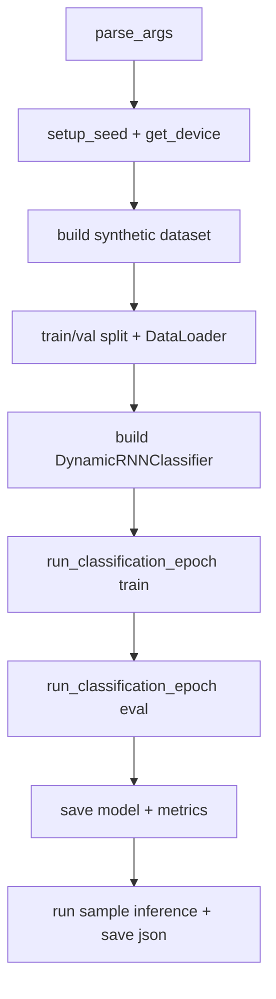
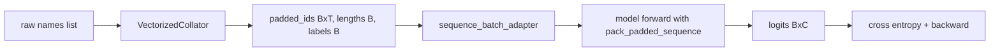
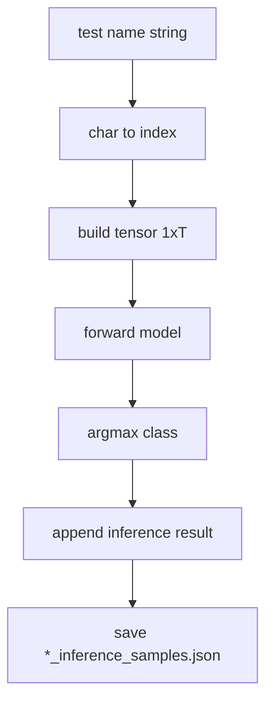

# Chapter 06 Code Logic README（完整版讲义）

## 0. 读者定位与学习目标
这份讲义面向想把 RNN/LSTM/GRU 训练流程“看懂并改得动”的读者。读完后你应该能：
1. 解释 `main.py` 里数据、模型、训练、验证、推理的完整顺序。
2. 看懂变长序列是如何通过 `collate + batch_adapter + pack` 串起来的。
3. 理解为什么修复了原先“首 batch 提前 return”会显著影响训练。
4. 快速定位每种模型（rnn/lstm/gru）的指标和推理样例输出。

## 1. 最小运行命令与推荐顺序
```bash
# LSTM 冒烟
python chapter_06_rnn_lstm_seq/main.py --model_type lstm --epochs 1 --data_size 2000

# RNN / GRU 冒烟
python chapter_06_rnn_lstm_seq/main.py --model_type rnn --epochs 1 --data_size 2000
python chapter_06_rnn_lstm_seq/main.py --model_type gru --epochs 1 --data_size 2000
```

推荐顺序：
1. 先跑 `lstm`，确认训练和验证指标都在更新。
2. 再跑 `rnn/gru` 做结构对照。
3. 最后查看 `results/*_inference_samples.json` 验证推理链路。

## 2. 文件地图（职责拆分）
| 文件 | 职责 | 关键函数/类 |
|---|---|---|
| `main.py` | 训练调度、验证、样例推理、结果保存 | `parse_args`, `build_dataloaders`, `sequence_batch_adapter`, `main` |
| `model.py` | 通用 RNN/LSTM/GRU 分类器 | `DynamicRNNClassifier.forward` |
| `dataset.py` | 合成名字数据生成与 padding collator | `SyntheticNameDataset`, `VectorizedCollator` |
| `utils/train_loop.py` | 通用分类 epoch 循环 | `run_classification_epoch` |

## 3. Mermaid 图 1：端到端流程


## 4. Mermaid 图 2：变长序列训练数据流（含 shape）


关键点：
1. `lengths` 必须保留在 CPU，才能稳定用于 `pack_padded_sequence`。
2. 训练和验证都走统一 `run_classification_epoch`，减少重复逻辑。
3. 新版每个 epoch 都会跑完整 DataLoader，不再首 batch 提前结束。

## 5. Mermaid 图 3：样例推理流程


## 6. 关键函数逐段解释
### 6.1 `build_dataloaders(dataset, batch_size, val_split, num_workers)`
1. 根据 `val_split` 做随机切分。
2. 复用同一个 `VectorizedCollator`，保证 train/val 编码一致。
3. 返回 `train_loader` 和 `val_loader`，形成真实验证闭环。

### 6.2 `sequence_batch_adapter(batch, device)`
1. 负责把 batch 解包成 `(inputs, lengths)` 和 `targets`。
2. `inputs/targets` 放到计算设备。
3. `lengths` 保留 CPU，兼容 packed sequence。

### 6.3 `evaluate_inference(...)`
1. 对固定样例集做推理，验证端到端是否可用。
2. 同时输出日志并落盘 JSON，方便后续回归对比。

## 7. 产物清单与定位
| 产物 | 路径 | 用途 |
|---|---|---|
| 模型权重 | `chapter_06_rnn_lstm_seq/checkpoints/{model_type}_model.pth` | 推理复用 |
| 指标文件 | `chapter_06_rnn_lstm_seq/results/{model_type}_metrics.json` | 训练/验证曲线分析 |
| 推理样例 | `chapter_06_rnn_lstm_seq/results/{model_type}_inference_samples.json` | 快速 sanity check |
| 词表 | `chapter_06_rnn_lstm_seq/data/vocab.txt` | 字符索引映射 |
| 合成数据 | `chapter_06_rnn_lstm_seq/data/synthetic_names.txt` | 数据抽样检查 |

## 8. 常见故障定位
1. 验证精度始终不变：检查 `val_split` 是否设置过小或数据量过低。
2. `pack_padded_sequence` 报错：确认 `lengths` 是 CPU long tensor。
3. 训练不稳定：先降低学习率或减小 `--max_grad_norm`。
4. 推理输出全偏某一类：先检查训练轮数、数据规模和类别分布。

## 9. 一句话复盘
本章重构重点是“补齐真实验证流程 + 统一 batch 适配层 + 修复 epoch 提前退出”，让序列模型训练流程从演示脚本提升为可复现实验脚本。
