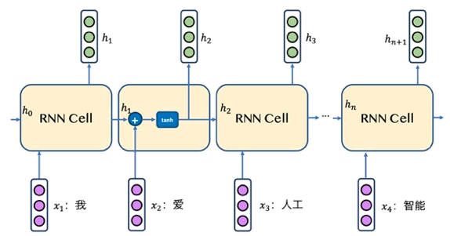
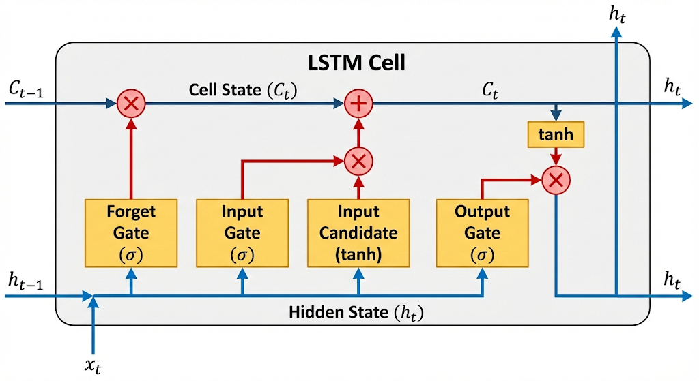

# Chapter 06: Sequence Modeling - RNN & LSTM (Theoretical Review)

欢迎来到序列建模章节。在之前的 CNN 章节中，我们处理的是具有空间特征的网格数据（如图像）。但在自然语言处理（NLP）、语音识别和时间序列预测中，数据具有显著的**时间依赖性**。

本节我们将深入探讨循环神经网络（RNN）及其进化变体长短期记忆网络（LSTM），重点关注它们如何解决“记忆”问题以及工程实现的细节。

---

## 1. 序列建模基础 (Foundations)

### 1.1 为什么 MLP 无法处理序列？
传统的全连接网络（MLP）在处理序列数据时面临两个致命缺陷：
1.  **输入维度固定**：MLP 需要固定的输入大小（例如 $28 \times 28$ 像素）。而句子或音频片段的长度是可变的。
2.  **无时序记忆 (No Temporal Memory)**：MLP 独立处理每个输入，无法捕捉前后文关系。例如，在理解 "The bank of the river" 和 "Bank account" 时，"Bank" 的含义完全依赖于上下文。

### 1.2 RNN 核心原理

RNN 通过引入 **隐状态 (Hidden State)** 来解决这个问题。隐状态可以被视为网络的“记忆”，它在时间步（Time Steps）之间传递。

#### 数学表达
对于时间步 $t$，RNN 接收当前输入 $x_t$ 和上一时刻的隐状态 $h_{t-1}$，计算新的隐状态 $h_t$ 和输出 $y_t$：

$$
h_t = \tanh(W_{ih} x_t + b_{ih} + W_{hh} h_{t-1} + b_{hh})
$$

$$
y_t = W_{hy} h_t + b_{hy}
$$

* **参数共享 (Parameter Sharing)**：在所有时间步中，$W_{ih}, W_{hh}, W_{hy}$ 是共享的。这意味着模型在学习通用的序列模式，而不是针对特定位置学习。

#### 简明图解：按时间步展开 (Unrolling)
可以将 RNN 看作是同一个网络单元在时间上的多次复制：
`x_0` -> [RNN] -> `h_0` -> [RNN] -> `h_1` ...

### 1.3 BPTT 与 梯度问题
RNN 的训练依赖于 **随时间反向传播 (Backpropagation Through Time, BPTT)**。这本质上是将 RNN 展开后的链式法则。

* **梯度消失 (Vanishing Gradient)**：
    由于链式法则涉及连乘，如果权重矩阵的特征值小于 1（或激活函数导数小于 1，如 Tanh/Sigmoid），经过多层传递后梯度会趋近于 0。这导致 RNN **无法捕捉长距离依赖**（例如：句首的主语决定了句尾的动词形态，但 RNN 此时已经“忘”了主语）。
* **梯度爆炸 (Exploding Gradient)**：
    反之，如果梯度过大，权重会大幅更新导致网络不稳定（通常通过 `gradient clipping` 解决）。

---

## 2. LSTM (Long Short-Term Memory)

LSTM 通过引入 **细胞状态 (Cell State)** 和 **门控机制 (Gating Mechanisms)** 巧妙地解决了梯度消失问题。

### 2.1 核心设计：双线传输
* **Hidden State ($h_t$)**：短期记忆，类似于 RNN 的输出，对当前时刻敏感，用于输出预测。
* **Cell State ($C_t$)**：长期记忆（传送带），信息可以在其上无阻碍地流转，仅进行线性的加减操作，极大地缓解了梯度消失。

### 2.2 门控机制详解
我们可以将门控想象成电路中的**模拟开关**（使用 Sigmoid 函数，输出 0~1），决定信息通过的比例。

#### A. 遗忘门 (Forget Gate) - "我们要忘掉什么？"
决定从旧的细胞状态 $C_{t-1}$ 中丢弃哪些信息。
> **例子**：当你读到 "Alice is a girl. **Bob**..." 时，看到 Bob，遗忘门会降低对 Alice（女性代词）的关注权重。

$$
f_t = \sigma(W_f \cdot [h_{t-1}, x_t] + b_f)
$$

#### B. 输入门 (Input Gate) - "我们要记住什么新信息？"
决定当前输入 $x_t$ 中哪些信息值得存入细胞状态。包含两部分：
1.  **Sigmoid 层 ($i_t$)**：决定更新哪些值。
2.  **Tanh 层 ($\tilde{C}_t$)**：创建新的候选值向量。
> **例子**：将 Bob（男性代词）的信息添加到状态中。

$$
i_t = \sigma(W_i \cdot [h_{t-1}, x_t] + b_i)
$$

$$
\tilde{C}_t = \tanh(W_C \cdot [h_{t-1}, x_t] + b_C)
$$

#### C. 细胞状态更新 (Cell Update) - "执行遗忘和记忆"
这是 LSTM 的核心魔法，通过**线性运算**更新长期记忆：

$$
C_t = f_t * C_{t-1} + i_t * \tilde{C}_t
$$

* $f_t * C_{t-1}$：遗忘旧信息。
* $i_t * \tilde{C}_t$：添加新信息。
* **为什么解决梯度消失？** 注意这里是**加法**运算。在反向传播求导时，加法算子的梯度能够直接（无损）分配，这就像一条梯度的“高速公路”。

#### D. 输出门 (Output Gate) - "我们要输出什么？"
基于当前的细胞状态和输入，决定隐状态 $h_t$（输出）。
> **例子**：既然主语是 Bob（单数），接下来预测动词时应该输出单数形式（如 "is" 而不是 "are"）。

$$
o_t = \sigma(W_o \cdot [h_{t-1}, x_t] + b_o)
$$

$$
h_t = o_t * \tanh(C_t)
$$

---

## 3. PyTorch 实践细节与维度陷阱

在工程实现中，维度控制是最大的痛点。

### 3.1 核心参数解析
`nn.LSTM(input_size, hidden_size, num_layers)`
* `input_size`: 输入特征的维度。例如 Word Embedding 维度 (e.g., 512) 或时间序列的变量数。
* `hidden_size`: 隐状态/细胞状态的维度。这是模型的“容量”或“宽度”。
* `num_layers`: 堆叠 LSTM 的层数（深度）。

### 3.2 Batch First: 维度的战争
PyTorch 默认是 `batch_first=False`，这是源于 cuDNN 的优化习惯，但对人类直觉不友好。

| 模式 | 张量形状 (Tensor Shape) | 适用场景 |
| :--- | :--- | :--- |
| **Default** | `(Seq_Len, Batch_Size, Feature_Dim)` | 原始 PyTorch 习惯，利于时间步循环优化 |
| **batch_first=True** | `(Batch_Size, Seq_Len, Feature_Dim)` | **推荐**。符合人类直觉，与其他层（Conv, Transformer）兼容性好 |

> [!TIP]
建议在定义 RNN/LSTM 时总是设置 `batch_first=True`，以减少维度转换的困扰。

### 3.3 nn.RNN vs nn.RNNCell
* **nn.RNN / nn.LSTM**: 处理**整个序列**。输入是一个序列张量，内部自动循环所有时间步。适合训练阶段。
* **nn.RNNCell / nn.LSTMCell**: 处理**单个时间步**。输入是 $(x_t, h_{t-1})$。适合需要手动控制每一步的复杂场景（如 Attention 解码器）。

### 3.4 双向 RNN (Bidirectional)
设置 `bidirectional=True`。模型会包含两个独立的 RNN（前向和后向）。
* **Output 维度变化**: `hidden_size` 变为 `hidden_size * 2`。
* **直觉**: 预测 "I ___ hungry" 时，仅看 "I" 是不够的，看到后面的 "hungry" 对填充 "am" 至关重要。

---

## 4. 理论验证与代码示例

以下代码展示如何在 PyTorch 中定义和检查 LSTM 结构，为后续完整工程做准备。
> [!NOTE]
> 代码文件已实现
> - EASY: [easy_demo.py](examples/easy_demo.py)
> - COMPLEX: [sentime_lstm_demo.py](examples/sentime_lstm_demo.py)
### 4.1 Simple Example: 维度推演
手动推演一个简单的序列 `Hello` -> `ello` (Char-level RNN 概念验证)。

```python
import torch
import torch.nn as nn
from utils import count_parameters

# 简单配置
input_dim = 10   # 假设 One-hot 编码维度
hidden_dim = 20  # 记忆容量
num_layers = 1
batch_size = 3
seq_len = 5      # 序列长度 "Hello"

# 定义 LSTM
# 偏好：batch_first=True
lstm = nn.LSTM(
    input_size = input_dim,
    hidden_size = hidden_dim,
    num_layers = num_layers,
    batch_first = True
)

# 构造虚构输入 (Batch, Seq, Feature)
x = torch.randn(batch_size, seq_len, input_dim)

# 前向传播
# out: 所有时间步的隐状态 (Batch, Seq, Hidden)
# (h_n, c_n): 最后一个时间步的隐状态和细胞状态
out, (h_n, c_n) = lstm(x)

print(f"Input Shape: {x.shape}")        # torch.Size([3, 5, 10])
print(f"Output Shape: {out.shape}")     # torch.Size([3, 5, 20]) -> 包含每一步的特征
print(f"Hidden State Shape: {h_n.shape}") # torch.Size([1, 3, 20]) -> (Layers, Batch, Hidden)

# 验证: Output 的最后一步是否等于 Hidden State 的最后一步?
# 注意: 如果是双向 LSTM，这里会有所不同
assert torch.allclose(out[:, -1, :], h_n[-1, :, :])
print(">> Simple verification passed: Output last step matches Hidden State.")
```

### 4.2 Complex Example: 情感分类架构设计
这是一个典型的 "Many-to-One" 架构。我们使用 LSTM 处理变长序列，取最后一个时间步的状态进行分类。
```python
import os
import sys
import logging

import torch
import torch.nn as nn

sys.path.append(os.getcwd())

from utils import log_model_info, get_device

logger = logging.getLogger("sentime_lstm_demo") 

class SentimentLSTM(nn.Module):
    def __init__(
        self,
        vocab_size: int,
        embedding_dim: int,
        hidden_dim: int,
        output_dim: int,
        n_layers: int,
        bidirectional: bool,
        dropout: float,
    ):
        super().__init__()

        # Embedding layer: maps vocabulary indices to dense vectors
        self.embedding = nn.Embedding(vocab_size, embedding_dim)

        # LSTM layer: processes sequences of embeddings
        self.lstm = nn.LSTM(
            input_size = embedding_dim,
            hidden_size = hidden_dim,
            num_layers = n_layers,
            bidirectional = bidirectional,
            dropout = dropout if n_layers > 1 else 0,
            batch_first = True
        )

        # Fully connected layer: maps LSTM outputs to output dimension
        self.fc = nn.Linear(hidden_dim * 2, output_dim)

        self.dropout = nn.Dropout(dropout)

    def forward(self, text, text_lengths):
        """
        text: [batch size, sent len] - LongTensor
        text_lengths: [batch size] - CPU Tensor, packing the sequence lengths
        """
        # [batch size, sent len] -> [batch size, sent len, emb dim]
        embedded = self.dropout(self.embedding(text))

        # pack sequence
        packed_embedded = nn.utils.rnn.pack_padded_sequence(
            embedded,
            text_lengths,
            batch_first = True,
            enforce_sorted = False
        )

        # packed_outputs is a PackedSequence
        # hidden: (num_layers * num_directions, batch size, hidden dim)
        # cell: (num_layers * num_directions, batch size, hidden dim)
        packed_output, (hidden, cell) = self.lstm(packed_embedded)

        # Unpack output (如果需要所有时间步的输出，例如 seq2seq)
        # output, output_lengths = nn.utils.rnn.pad_packed_sequence(packed_output, batch_first=True)
        
        # 获取最后一次的隐状态用于分类
        # hidden 包含 [forward_layer_0, backward_layer_0, forward_layer_1, backward_layer_1...]
        # 我们需要最后两层（最后一层的 fwd 和 bwd）

        hidden_fwd = hidden[-2, :, :]
        hidden_bwd = hidden[-1, :, :]

        # [batch size, hidden dim * 2]
        cat_hidden = torch.cat((hidden_fwd, hidden_bwd), dim = 1)
        return self.fc(self.dropout(cat_hidden))
    
if __name__ == "__main__":
    logging.basicConfig(
        level = logging.INFO,
        format = '%(asctime)s - %(name)s - %(levelname)s - %(message)s',
        handlers = [logging.StreamHandler(sys.stdout)]
    )

    device = get_device()
    logger.info(f"Using device: {device}")

    model = SentimentLSTM(
        vocab_size = 1000,
        embedding_dim = 128,
        hidden_dim = 256,
        output_dim = 2,
        n_layers = 2,
        bidirectional = True,
        dropout = 0.5
    ).to(device)

    log_model_info(model)
    logger.info("Model architecture defined specifically for sequence classification.")
```