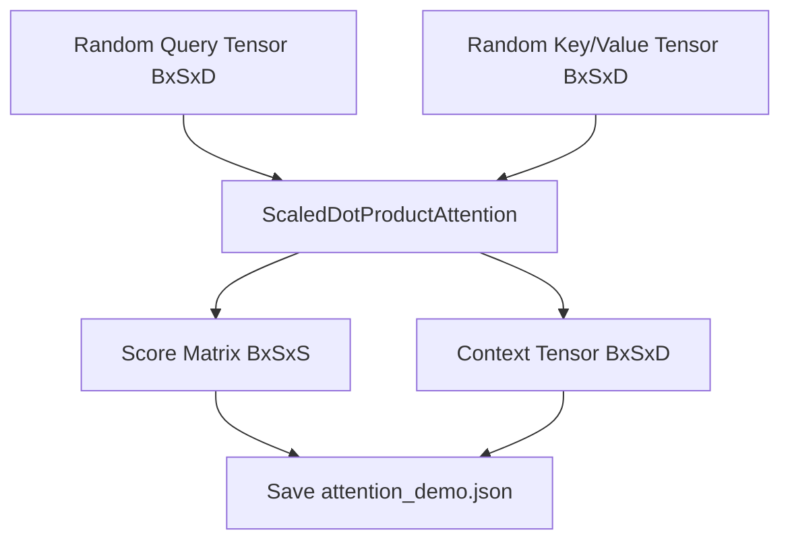
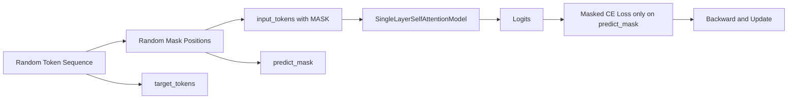

# Chapter 07 Code Logic README

## 1. 总体流程
本章包含两条主线：
1. `demo.py`：直接验证 Attention Score 与 Context 的形状和含义。
2. `train.py`：在掩码复制任务上训练单层自注意力模型。

---

## 2. Demo 数据流


关键点：
1. `scores` 是 `softmax` 后的权重分布，可解释每个 query 位置关注了哪些 key 位置。
2. `context` 是按分数加权后的信息融合结果。

---

## 3. 训练数据流（Masked Copy）


关键点：
1. 只在 `predict_mask == True` 的位置计算损失。
2. 非 mask 位置不计入训练目标，避免任务退化成简单复制。

---

## 4. 文件级实现说明

### 4.1 `attention.py`
`ScaledDotProductAttention.forward(q, k, v, mask = None)`：
1. 计算 `raw_scores = q @ k^T / sqrt(d_k)`。
2. 对 mask 位置做极小值填充。
3. `softmax` 后得到 `attention_scores`。
4. `context = attention_scores @ v`。

### 4.2 `masks.py`
1. `build_padding_mask(tokens, pad_token_id)` 返回 `[B, 1, 1, S]`。
2. `build_causal_mask(seq_len, device)` 返回 `[1, 1, S, S]`。

### 4.3 `dataset.py`
1. `MaskedCopyDataset`：随机序列 + 随机 mask。
2. `MaskedCopyCollator`：padding 到 batch 内统一长度。

### 4.4 `model.py`
`SingleLayerSelfAttentionModel`：
1. Embedding 编码 token。
2. 线性映射生成 Q/K/V。
3. 单层 Attention 聚合。
4. Add & Norm 后映射到词表 logits。

### 4.5 `train.py`
1. `parse_args()`：集中管理训练参数。
2. `run_epoch()`：训练/验证统一逻辑。
3. `compute_masked_loss()`：仅在 mask 位计算 CE。
4. `collect_prediction_examples()`：导出样例便于回归。

---

## 5. 最小验收命令
```bash
python chapter_07_attention_mechanism/demo.py
python chapter_07_attention_mechanism/train.py --epochs 1 --num_samples 2000
```

验收标准：
1. 生成 `results/attention_demo.json`。
2. 生成 `results/metrics.json`、`results/predictions.json`、`results/run_config.json`。
3. 生成 `checkpoints/ch07_single_attn_best.pth`。
