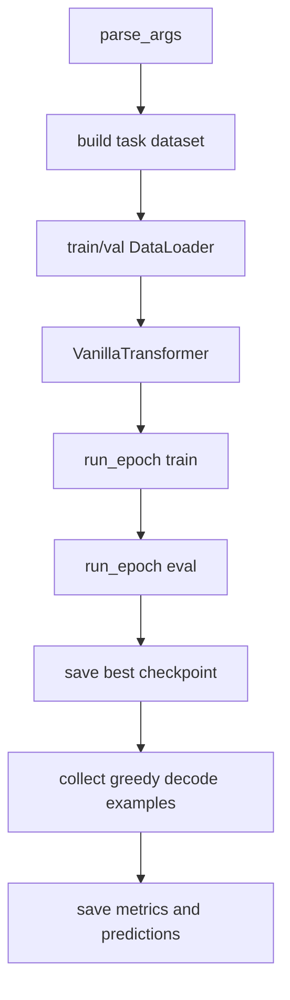
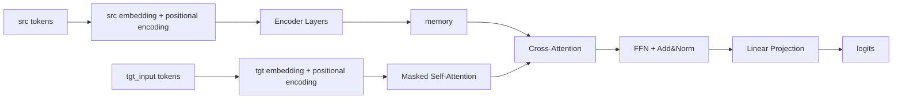

# Chapter 08 Code Logic README

## 1. 训练主流程
`train.py` 用一个入口覆盖两类任务（`sort` 与 `translate`）：
1. 解析参数与设定随机种子。
2. 根据 `--task` 构建对应数据集。
3. 初始化 `VanillaTransformer`。
4. 训练/验证循环并保存最佳权重。
5. 导出指标与样例预测。

---

## 2. Mermaid 图 1：训练流程总览


---

## 3. Mermaid 图 2：Encoder-Decoder 前向数据流


---

## 4. 模块逐段解析

### 4.1 `attention.py`
1. `ScaledDotProductAttention`：计算 `QK^T / sqrt(d_k)`，mask 后 softmax，最后与 `V` 相乘。
2. `MultiHeadAttention`：线性投影 -> 拆头 -> 注意力 -> 合并头 -> 输出投影。

### 4.2 `positional_encoding.py`
1. 使用固定正弦余弦公式。
2. 通过 `register_buffer("pe", pe)` 挂载，不参与梯度更新。

### 4.3 `encoder.py`
`TransformerEncoderLayer`：
1. Self-Attention
2. Add & Norm
3. FFN
4. Add & Norm

### 4.4 `decoder.py`
`TransformerDecoderLayer`：
1. Masked Self-Attention
2. Cross-Attention（读 Encoder memory）
3. FFN
4. 每段后都有 Add & Norm

### 4.5 `transformer.py`
`VanillaTransformer`：
1. `encode()` 生成 memory。
2. `decode()` 结合 memory 生成 decoder states。
3. `forward()` 返回 logits（可选 attention maps）。
4. `greedy_decode()` 支持推理样例导出。

### 4.6 `dataset.py`
1. `SortDataset`：源序列随机生成，目标序列为排序结果。
2. `ToyTranslationDataset`：从本地 TSV 读取并构建联合词表。
3. `Seq2SeqCollator`：统一 padding。

---

## 5. 最小验收命令
```bash
python chapter_08_transformer_vanilla/train.py --task sort --epochs 1 --num_samples 2000
python chapter_08_transformer_vanilla/train.py --task translate --epochs 1
```

验收标准：
1. 生成排序任务指标/预测/ckpt。
2. 生成翻译任务指标/预测/ckpt。
3. `results/run_config.json` 保存本次任务配置。
