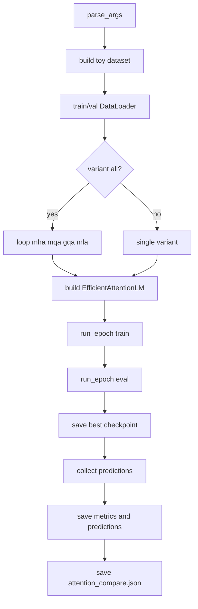
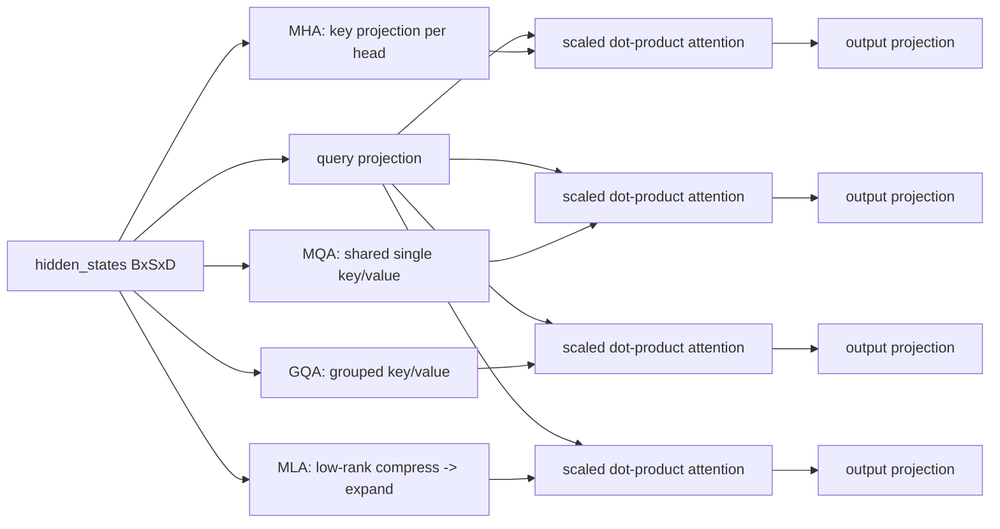

# Chapter 09 Code Logic README

## 1. 训练主流程
`train.py` 使用统一入口支持四变体单跑或全跑：
1. `parse_args()` 解析配置。
2. 构建 `ToyNextTokenDataset` 和 dataloader。
3. 根据 `--variant` 选择 `mha/mqa/gqa/mla`。
4. 训练与验证循环，保存每个变体最佳 checkpoint。
5. 导出 `metrics_*.json`、`predictions_*.json`，并汇总 `attention_compare.json`。

---

## 2. Mermaid 图 1：训练流程总览


---

## 3. Mermaid 图 2：四变体前向数据流


---

## 4. 文件角色表
| 文件 | 角色 | 重点 |
|---|---|---|
| `common.py` | 公共配置与复杂度工具 | `AttentionConfig`, `variant_kv_channels` |
| `mha.py` | 标准 MHA | 独立 Q/K/V 多头 |
| `mqa.py` | MQA | Query 多头 + K/V 共享 |
| `gqa.py` | GQA | 分组共享 K/V |
| `mla.py` | MLA | `compress -> expand` 低秩路径 |
| `dataset.py` | 数据构造 | `ToyNextTokenDataset` |
| `model.py` | 模型壳与变体工厂 | `build_attention_block`, `EfficientAttentionLM` |
| `demo.py` | 机制对比 | 输出统计、相似度、缓存对比 |
| `benchmark.py` | 性能基准 | 延迟与缓存曲线 |
| `train.py` | 训练与落盘 | `--variant all` 聚合对比 |

---

## 5. 最小验收命令
```bash
python chapter_09_efficient_attention/demo.py
python chapter_09_efficient_attention/benchmark.py --seq_lens 128,256,512
python chapter_09_efficient_attention/train.py --variant all --epochs 1 --num_samples 2000
```

验收标准：
1. `results/attention_compare.json` 存在且含四变体条目。
2. `results/metrics_*.json` 与 `results/predictions_*.json` 四组文件存在。
3. `checkpoints/*_best.pth` 四个文件存在。
4. `images/` 目录下有 demo 与 benchmark 图像文件。
