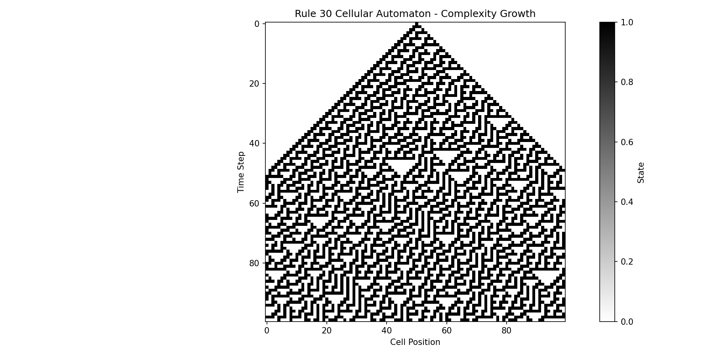
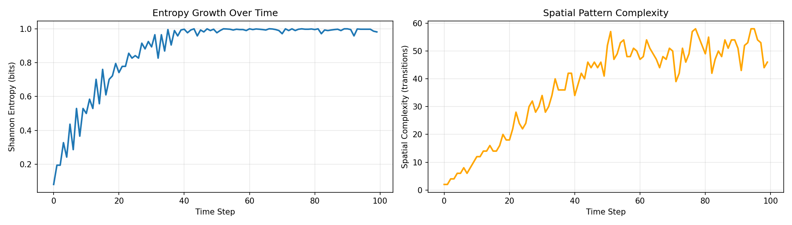
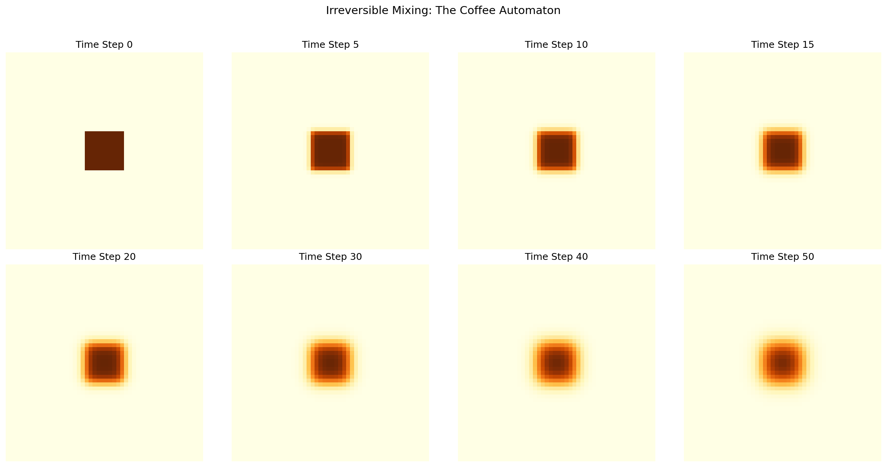
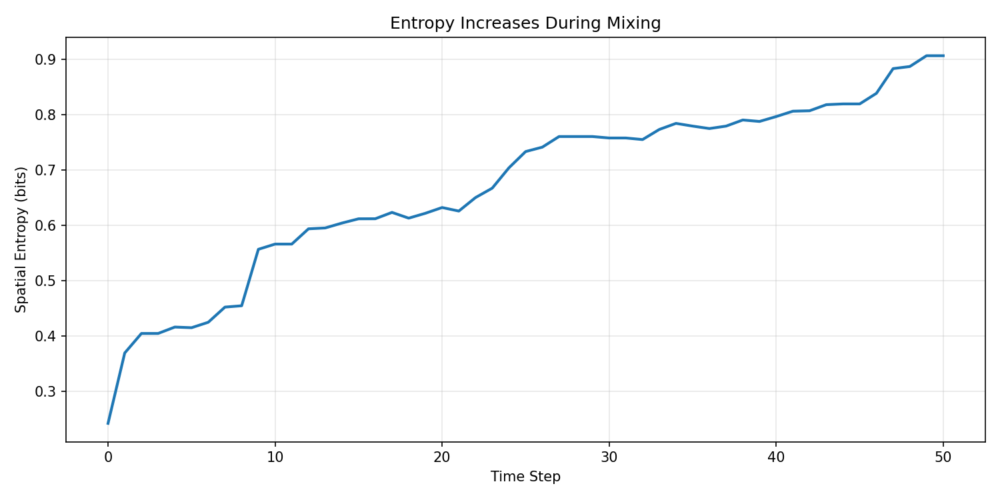

# Paper 1: The First Law of Complexodynamics

本章把复杂动力学（complexodynamics）的核心直觉落到两个可运行实验：
1. Rule 30 元胞自动机：局部规则简单，但全局纹理复杂。
2. 二维扩散混合：从局部有序到全局均匀，体现统计意义上的时间方向。

目标是建立“可计算、可观察、可解释”的机制直觉，而不是做高保真物理仿真。

## 1. 问题定义 (Problem Statement)
给定一个简单初态和固定局部更新规则，我们关心：
1. 复杂结构是否会自发出现？
2. 可度量的无序度（entropy）是否整体上升？
3. 为什么这个过程在统计上表现为“前向易、逆向难”？

## 2. 符号表 (Notation)
| 符号 | 含义 |
|---|---|
| $x_i^t$ | 一维元胞自动机中位置 $i$ 在时刻 $t$ 的二值状态，$x_i^t \in \{0, 1\}$ |
| $N$ | 元胞自动机宽度（`--ca-size`） |
| $H_t$ | 时刻 $t$ 的 Shannon entropy |
| $C_t$ | 时刻 $t$ 的空间复杂度（相邻状态切换次数） |
| $u_{i,j}^t$ | 二维扩散网格在时刻 $t$ 的浓度值 |
| $r$ | 扩散率（`--diffusion-rate`） |
| $\bar{u}_{\mathcal{N}(i,j)}^t$ | $(i,j)$ 四邻域均值 |

## 3. 核心公式 (Core Equations)

### 3.1 Rule 30 更新
脚本 `rule_30(left, center, right)` 对应：
$$
x_i^{t+1} = f(x_{i-1}^t, x_i^t, x_{i+1}^t)
$$
其中 Rule 30 可写成查表：
$$
111, 110, 101, 100, 011, 010, 001, 000 \mapsto 0, 0, 0, 1, 1, 1, 1, 0
$$
等价布尔表达可写为：
$$
x_i^{t+1} = x_{i-1}^t \oplus (x_i^t \lor x_{i+1}^t)
$$

### 3.2 周期边界 (Periodic Boundary)
脚本 `evolve_ca()` 使用取模索引：
$$
x_{-1}^t = x_{N-1}^t, \quad x_N^t = x_0^t
$$
即左右边界首尾相连，避免边界单独规则干扰趋势观察。

### 3.3 Shannon 熵
对二值分布 $p_t(v)$（$v \in \{0,1\}$）：
$$
H_t = -\sum_{v \in \{0,1\}} p_t(v) \log_2 p_t(v)
$$
对应 `measure_entropy_over_time()`。

### 3.4 空间复杂度（边界计数）
$$
C_t = \sum_{i = 1}^{N-1} \left|x_{i+1}^t - x_i^t\right|
$$
对应 `measure_spatial_complexity()`，本质是统计黑白交界数。

### 3.5 二维扩散离散更新（邻域平均形式）
$$
u_{i,j}^{t+1} = (1-r)u_{i,j}^{t} + r\,\bar{u}_{\mathcal{N}(i,j)}^t,
\quad
\bar{u}_{\mathcal{N}(i,j)}^t = \frac{u_{i-1,j}^t + u_{i+1,j}^t + u_{i,j-1}^t + u_{i,j+1}^t}{4}
$$

### 3.6 二维扩散离散更新（扩散项形式）
上式等价为：
$$
u_{i,j}^{t+1} = u_{i,j}^{t} + \frac{r}{4}
\left(
 u_{i-1,j}^t + u_{i+1,j}^t + u_{i,j-1}^t + u_{i,j+1}^t - 4u_{i,j}^t
\right)
$$
对应 `diffusion_2d()` 的内部更新逻辑。

### 3.7 混合熵（直方图离散后）
将网格值离散到 `bins` 个桶，桶概率为 $q_k$：
$$
H_t^{mix} = -\sum_k q_k \log_2 q_k
$$
对应 `measure_mixing_entropy()`。

## 4. 公式到代码映射 (Code-to-Formula Mapping)
| 机制 | 公式 | 代码位置 |
|---|---|---|
| Rule 30 状态转移 | $x_i^{t+1} = f(\cdot)$ | `rule_30()` |
| 时间展开 | 周期边界 + 逐时迭代 | `evolve_ca()` |
| Shannon 熵 | $H_t$ | `measure_entropy_over_time()` |
| 空间复杂度 | $C_t$ | `measure_spatial_complexity()` |
| 扩散更新 | 邻域平均 / 扩散项等价式 | `diffusion_2d()` |
| 混合熵 | $H_t^{mix}$ | `measure_mixing_entropy()` |

## 5. 图像解读 (Figure Walkthrough)

### 5.1 `images/rule_30_evolution.png`

- 看什么：横轴是 cell position，纵轴是 time step，黑白表示 0/1 状态。
- 说明什么：从中心单点激发后，图案快速变得非平凡且不规则。
- 对应机制：Rule 30 的局部映射 $f$ 虽简单，但迭代组合导致全局复杂结构涌现。

### 5.2 `images/entropy_complexity.png`

- 看什么：左图是 $H_t$，右图是 $C_t$ 随时间变化。
- 说明什么：熵与边界切换数从低值区进入更高区间，系统“展开”到更复杂状态。
- 对应机制：统计层面的分布扩展（$H_t$）与几何层面的边界增长（$C_t$）同步可见。

### 5.3 `images/coffee_mixing_grid.png`

- 看什么：多个时间切片中，高浓度块逐步扩散、边缘被抹平。
- 说明什么：局部梯度不断减小，状态趋向更均匀分布。
- 对应机制：离散扩散更新不断把局部极值向邻域平均回拉。

### 5.4 `images/coffee_mixing_entropy.png`

- 看什么：混合熵 $H_t^{mix}$ 的时间曲线。
- 说明什么：总体上升（允许局部波动），表示空间分布更“铺开”。
- 对应机制：直方图概率质量更分散，熵值提高。

## 6. 实验结果解读 (Result Interpretation)
本章以机制观察为主，不固定单次数值结论。不同随机种子、网格尺度、桶数与步数会改变曲线细节，但以下现象应稳定出现：
1. Rule 30 从简单初态产生复杂纹理。
2. 熵与空间复杂度从低值向高值区迁移。
3. 扩散混合过程体现明显时间方向性。

## 7. 参数敏感性 (Parameter Sensitivity)
1. `--ca-steps` 增大：更容易观察长期纹理结构。
2. `--ca-size` 增大：统计曲线更平稳，边界效应更弱。
3. `--diffusion-rate` 增大：混合更快，熵更早进入平台期。
4. `--diffusion-steps` 增大：更完整展示“趋于均匀”的过程。

## 8. 局限性 (Limitations)
1. 这是机制演示，不是带完整守恒约束的物理仿真。
2. $C_t$ 是启发式复杂度指标，不等价于 Kolmogorov complexity。
3. 熵值会受离散桶数、网格大小、边界处理方式影响。

## 9. 为什么“前向易、逆向难” (Irreversibility Intuition)
1. 前向更新是局部映射压缩：多个微观状态可能映射到相似宏观纹理。
2. 混合过程逐步丢失“可区分的初态细节”，逆推时缺少充分信息。
3. 工程上可理解为：系统状态在前向中不断“信息聚合”，逆向恢复需要额外先验。

## 10. 复现实验命令 (Reproducibility)
```bash
conda run -n <ENV_NAME> python sutskever-implementations/01_complexity_dynamics/complexity_dynamics.py
```

常用参数：
- `--seed`
- `--ca-size` / `--ca-steps`
- `--diffusion-size` / `--diffusion-steps` / `--diffusion-rate`
- `--output-dir`
- `--no-save`
- `--show`

## 11. 参考资料与阅读顺序 (References)
1. Scott Aaronson, *The First Law of Complexodynamics*（建议先读，建立复杂性增长直觉）。
2. Stephen Wolfram, *A New Kind of Science*（Rule 30 与元胞自动机背景）。
3. Shannon, *A Mathematical Theory of Communication*（信息熵定义）。
4. Diffusion Equation / Discrete Laplacian 相关教材章节（理解扩散离散化）。
