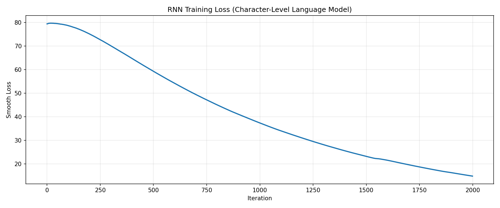
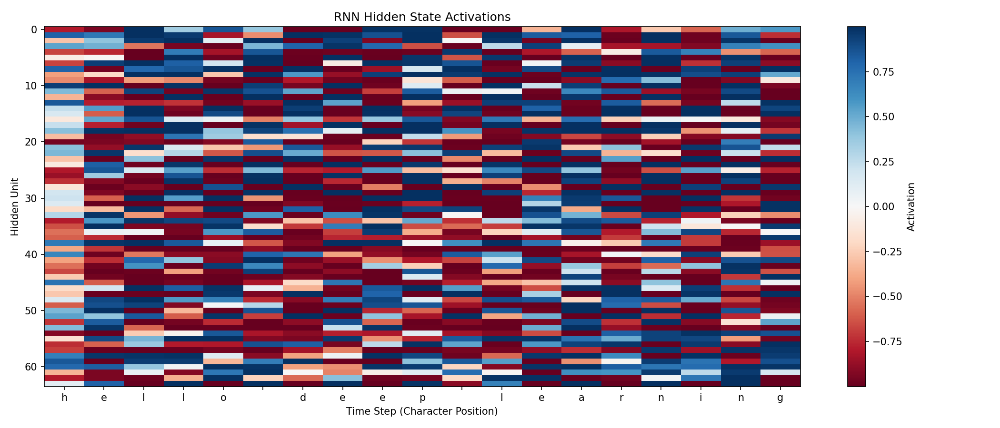

# Paper 2: The Unreasonable Effectiveness of Recurrent Neural Networks

本章复现 Karpathy 的字符级 Vanilla RNN 思路：
给定前一个字符，预测下一个字符，通过 BPTT 学习序列统计结构，并用采样文本与隐藏状态可视化观察“模型到底学到了什么”。

> [!NOTE]
> 本实验使用小型合成语料，目标是讲清训练机制与动力学，不是追求大规模语言模型性能。

## 1. 问题定义 (Problem Statement)
已知字符序列 $c_1, c_2, \dots, c_T$，构造监督任务：
- 输入：$c_t$
- 目标：$c_{t+1}$

这是最基础的 character-level language modeling。

## 2. 符号表 (Notation)
| 符号 | 含义 |
|---|---|
| $x_t$ | 时刻 $t$ 的 one-hot 输入向量 |
| $h_t$ | 时刻 $t$ 的隐藏状态 |
| $y_t$ | 时刻 $t$ 的未归一化输出（logits） |
| $p_t$ | 时刻 $t$ 的字符概率分布 |
| $\theta$ | 模型参数集合：$W_{xh}, W_{hh}, W_{hy}, b_h, b_y$ |
| $L$ | 序列总损失（字符级交叉熵累加） |
| $\eta$ | 学习率（`--learning-rate`） |

## 3. 核心公式 (Core Equations)

### 3.1 前向传播
$$
h_t = \tanh(W_{xh}x_t + W_{hh}h_{t-1} + b_h)
$$

$$
y_t = W_{hy}h_t + b_y
$$

$$
p_t = \text{softmax}(y_t)
$$

对应代码：`VanillaRNN.forward()`。

### 3.2 序列损失
$$
L = -\sum_{t=1}^{T} \log p_t\big(c_{t+1}\big)
$$
对应代码：`VanillaRNN.loss()`。

### 3.3 BPTT 关键递推
令目标 one-hot 为 $\hat{y}_t$，则：
$$
\delta y_t = p_t - \hat{y}_t
$$

$$
\nabla_{W_{hy}} L += \delta y_t h_t^\top,
\quad
\nabla_{b_y} L += \delta y_t
$$

$$
\delta h_t = W_{hy}^\top \delta y_t + \delta h_{t+1}^{\text{(recur)}}
$$

$$
\delta h_t^{\text{raw}} = (1 - h_t^2) \odot \delta h_t
$$

$$
\nabla_{W_{xh}} L += \delta h_t^{\text{raw}} x_t^\top,
\quad
\nabla_{W_{hh}} L += \delta h_t^{\text{raw}} h_{t-1}^\top,
\quad
\delta h_{t-1}^{\text{(recur)}} = W_{hh}^\top \delta h_t^{\text{raw}}
$$
对应代码：`VanillaRNN.backward()`。

### 3.4 Gradient Clipping
$$
g \leftarrow \text{clip}(g, -5, 5)
$$
用于抑制梯度爆炸，对应 `np.clip(..., -5, 5)`。

### 3.5 Adagrad 参数更新
对任一参数 $\theta$ 及其梯度 $g_t$：
$$
G_t = G_{t-1} + g_t \odot g_t
$$

$$
\theta \leftarrow \theta - \eta \cdot \frac{g_t}{\sqrt{G_t + \epsilon}}
$$
对应 `train_rnn()` 中 `mem += dparam * dparam` 与更新式。

### 3.6 平滑损失 (Smooth Loss)
$$
\text{smooth\_loss}_t = 0.999\cdot\text{smooth\_loss}_{t-1} + 0.001\cdot L_t
$$
对应训练日志曲线，减少短期抖动。

## 4. 公式到代码映射 (Code-to-Formula Mapping)
| 机制 | 公式 | 代码位置 |
|---|---|---|
| 前向传播 | $h_t, y_t, p_t$ | `VanillaRNN.forward()` |
| 序列损失 | $L$ | `VanillaRNN.loss()` |
| 时间反传 | BPTT 递推式 | `VanillaRNN.backward()` |
| 梯度裁剪 | $\text{clip}(g)$ | `VanillaRNN.backward()` |
| Adagrad | $G_t, \theta$ 更新 | `train_rnn()` |
| 文本采样 | 按 $p_t$ 抽样 | `VanillaRNN.sample()` |

## 5. 图像解读 (Figure Walkthrough)

### 5.1 `images/training_loss.png`

- 看什么：横轴是迭代步，纵轴是 smooth loss。
- 说明什么：损失整体下降，表示模型对下一个字符分布的拟合在改善。
- 对应机制：BPTT + Adagrad 逐步优化交叉熵目标。

> [!NOTE]
> loss 下降不等于文本一定“可读”。生成质量还受采样随机性、温度（本实现未显式设置）和长程记忆能力影响。

### 5.2 `images/hidden_state_activations.png`

- 看什么：横轴是字符时间步，纵轴是隐藏单元，颜色表示激活值正负与幅度。
- 说明什么：部分单元在特定字符上下文中反复激活，表现出模式敏感性。
- 对应机制：$h_t$ 通过循环连接编码上下文记忆，形成“时序痕迹”。

## 6. 训练动力学与定量结果 (Training Dynamics)
以下数值来自仓库已有文件：
- `results/summary.json`
- `results/training_samples.json`

### 6.1 损失收敛
- 初始平滑损失（迭代 0）：约 `79.4513`
- 中期平滑损失（迭代 1000）：约 `37.3905`
- 后期平滑损失（迭代 1800）：约 `17.8545`
- 训练结束 `final_loss`：`14.8374`

解读：模型先学到字符局部统计，再逐步形成稳定短语结构。

### 6.2 样本文本结构化过程
- 迭代 0：字符近似随机组合，词形非常不稳定。
- 迭代 1000：已能生成 `examples`, `patterns`, `data` 等高频片段。
- 迭代 1800：出现更长的可读词组与句式骨架（如 `information is everywhere` 的近似结构）。

解读：loss 与“可读性”常同步改善，但并非严格线性关系。

## 7. 参数敏感性与失败模式 (Sensitivity & Failure Modes)
1. 学习率 `--learning-rate` 过大：loss 振荡甚至发散，采样文本长期混乱。
2. 隐藏维度 `--hidden-size` 过小：记忆容量不足，长短语难形成。
3. 序列长度 `--seq-length` 过短：BPTT 截断严重，跨词模式难学习。
4. 采样间隔 `--sample-every` 过大：训练过程不可见，难以及时发现崩坏。
5. 迭代数 `--num-iterations` 不足：只学到局部字符统计，语义结构尚未形成。

## 8. 局限性 (Limitations)
1. 语料规模小、分布简单，结论偏机制教学。
2. Vanilla RNN 天然受梯度消失影响，长程依赖能力有限。
3. 采样方式为多项分布随机抽样，输出稳定性受随机种子影响。

## 9. 复现实验命令 (Reproducibility)
```bash
python sutskever-implementations/02_char_rnn_karpathy/02_char_rnn_karpathy.py
```

参数示例：
```bash
python sutskever-implementations/02_char_rnn_karpathy/02_char_rnn_karpathy.py \
  --num-iterations 2000 \
  --seq-length 25 \
  --hidden-size 64 \
  --sample-every 200
```

## 10. 参考资料与阅读顺序 (References)
1. Andrej Karpathy, *The Unreasonable Effectiveness of Recurrent Neural Networks*：
   `https://karpathy.github.io/2015/05/21/rnn-effectiveness/`
2. Ian Goodfellow et al., *Deep Learning* Chapter 10 (Sequence Modeling)：
   `https://www.deeplearningbook.org/contents/rnn.html`
3. BPTT 相关经典文献（建议配合教材章节阅读反向传播时间展开推导）。
