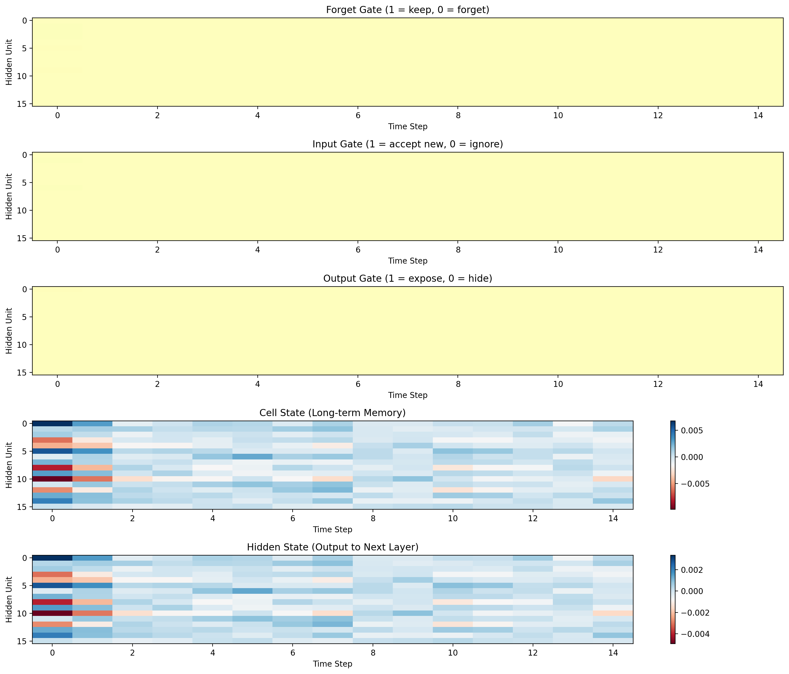
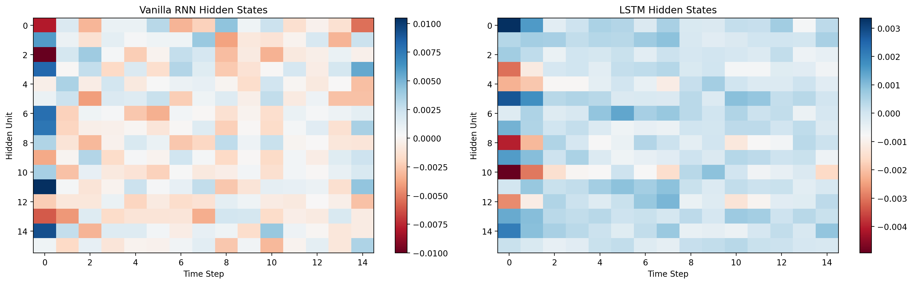

# Paper 3: Understanding LSTM Networks - 实践与可视化

本章基于 Olah 的 LSTM 解释框架，聚焦三个问题：
1. LSTM 的门控如何组织信息流？
2. LSTM 与 Vanilla RNN 的状态动力学有何差异？
3. 为什么 LSTM 在长依赖上更不容易梯度消失？

> [!NOTE]
> 本实现以机制演示为主，模型默认随机初始化，不做完整训练精度评测。

## 1. 问题定义 (Problem Statement)
我们希望在“可视化 + 可推导”层面回答：
1. 门控结构如何决定“写入、保留、输出”？
2. 在同一输入序列上，LSTM 与 Vanilla RNN 的隐状态演化差异是什么？
3. 梯度在时间维度上传播时，二者衰减速度为何不同？

## 2. 符号表 (Notation)
| 符号 | 含义 |
|---|---|
| $x_t$ | 时刻 $t$ 的输入向量 |
| $h_t$ | 时刻 $t$ 的隐藏状态 |
| $c_t$ | 时刻 $t$ 的细胞状态（long-term memory） |
| $f_t$ | forget gate 输出 |
| $i_t$ | input gate 输出 |
| $\tilde{c}_t$ | 候选记忆 |
| $o_t$ | output gate 输出 |
| $\sigma(\cdot)$ | sigmoid 函数 |

## 3. 核心公式 (Core Equations)

### 3.1 LSTM 门控更新
令拼接向量 $z_t = [x_t; h_{t-1}]$，则：
$$
f_t = \sigma(W_f z_t + b_f)
$$

$$
i_t = \sigma(W_i z_t + b_i)
$$

$$
\tilde{c}_t = \tanh(W_c z_t + b_c)
$$

$$
c_t = f_t \odot c_{t-1} + i_t \odot \tilde{c}_t
$$

$$
o_t = \sigma(W_o z_t + b_o)
$$

$$
h_t = o_t \odot \tanh(c_t)
$$
对应 `LSTMCell.forward()`。

### 3.2 输出层
$$
y = W_{hy} h_T + b_y
$$
对应 `LSTM.forward()` 末端。

### 3.3 梯度保留的关键项（可推导直觉）
忽略非线性局部项时，cell state 跨步雅可比近似包含：
$$
\frac{\partial c_t}{\partial c_{t-k}} \approx \prod_{j=t-k+1}^{t} f_j
$$
若多数 $f_j \approx 1$，该乘积衰减较慢；而 Vanilla RNN 常表现为反复乘以较小因子导致更快衰减。

### 3.4 本项目中的梯度流模拟公式
脚本 `simulate_gradient_flow()` 使用可解释性近似：
$$
g_k^{\text{RNN}} = (\alpha)^k, \quad \alpha = \mathrm{rnn_decay}
$$

$$
g_k^{\text{LSTM}} = (\beta)^k, \quad \beta = \mathrm{lstm_forget}
$$
注意这是机制模拟，不是训练反向传播中实时记录的真实梯度张量。

## 4. 公式到代码映射 (Code-to-Formula Mapping)
| 机制 | 公式 | 代码位置 |
|---|---|---|
| 门控与状态更新 | $f_t, i_t, \tilde{c}_t, c_t, o_t, h_t$ | `LSTMCell.forward()` |
| 序列前向 | $h_1\ldots h_T, c_1\ldots c_T$ | `LSTM.forward()` |
| Vanilla RNN 对照 | $h_t = \tanh(W[x_t;h_{t-1}] + b)$ | `VanillaRNNCell.forward()` |
| 梯度衰减模拟 | $g_k^{\text{RNN}}, g_k^{\text{LSTM}}$ | `simulate_gradient_flow()` |
| 可视化统计 | 门均值、状态方差、末端梯度 | `visualize_*` + `results/*.json` |

## 5. 图像解读 (Figure Walkthrough)

### 5.1 `images/lstm_gate_visualization.png`

- 看什么：前 3 行是 forget/input/output gate 热力图（0 到 1），后 2 行是 cell state 与 hidden state 热力图。
- 说明什么：不同时间步与不同隐藏单元上，门控强度并不一致，说明信息路由是“选择性”的。
- 对应机制：$c_t = f_t \odot c_{t-1} + i_t \odot \tilde{c}_t$ 与 $h_t = o_t \odot \tanh(c_t)$ 决定保留/写入/暴露比例。

### 5.2 `images/lstm_vs_vanilla_rnn_states.png`

- 看什么：左图 Vanilla RNN 隐状态，右图 LSTM 隐状态。
- 说明什么：两者在同一输入下呈现不同状态分布，LSTM 通过额外记忆通道与门控形成更可控的信息流。
- 对应机制：LSTM 拆分为 $c_t$ 与 $h_t$ 双通道；RNN 仅单通道递推。

### 5.3 `images/gradient_flow_comparison.png`

- 看什么：纵轴为对数尺度梯度幅值，横轴为“回溯到过去的步数”。
- 说明什么：RNN 曲线下降更陡，LSTM 曲线更平缓。
- 对应机制：乘积项中更大的保留因子（这里由 `lstm_forget` 近似）对应更慢的指数衰减。

## 6. 定量结果解读 (Quantitative Results)
以下数值来自 `results/lstm_understanding_summary.json`：

### 6.1 门控统计
- `forget_gate_mean`: `0.499997`
- `input_gate_mean`: `0.500086`
- `output_gate_mean`: `0.499916`

解读：默认随机初始化下，门值均值约 0.5，符合 sigmoid 在零附近输出中性的特征。

### 6.2 隐状态波动统计
- `rnn_hidden_std`: `0.002427`
- `lstm_hidden_std`: `0.000842`

解读：在当前随机初始化与输入设置下，LSTM 隐状态波动幅度更小。

### 6.3 梯度保留对比（30 步）
- `rnn_final_gradient`: `0.008977`
- `lstm_final_gradient`: `0.225936`

解读：LSTM 末端梯度约为 RNN 的 `25x`，与“较慢衰减”结论一致。

> [!NOTE]
> 以上是机制演示配置下的统计值，不应直接当作任务性能指标。

## 7. 参数敏感性 (Parameter Sensitivity)
1. `--seq-length` 增大：长依赖挑战更强，RNN 与 LSTM 差异更明显。
2. `--gradient-steps` 增大：梯度衰减曲线差距在 log 坐标下更直观。
3. `--rnn-decay` 减小：RNN 曲线下降更陡。
4. `--lstm-forget` 增大：LSTM 曲线更平缓，梯度保留更强。

## 8. 局限性 (Limitations)
1. 当前实验不包含完整训练闭环，主要展示结构与信息流。
2. 梯度对比图为模拟，不是自动求导得到的真实训练梯度。
3. 定量结果依赖随机种子与超参数，应做趋势理解而非绝对值比较。

## 9. 复现实验命令 (Reproducibility)
```bash
conda run -n <ENV_NAME> python sutskever-implementations/03_lstm_understanding/03_lstm_understanding.py
```

常用参数：
- `--seed`
- `--input-size` / `--hidden-size` / `--output-size`
- `--seq-length` / `--num-samples`
- `--gradient-steps` / `--rnn-decay` / `--lstm-forget`
- `--output-dir`
- `--use-tqdm`
- `--no-save`
- `--show`

## 10. 参考资料与阅读顺序 (References)
1. Christopher Olah, *Understanding LSTM Networks*：
   `https://colah.github.io/posts/2015-08-Understanding-LSTMs/`
2. Hochreiter, Schmidhuber (1997), *Long Short-Term Memory*：
   `https://www.bioinf.jku.at/publications/older/2604.pdf`
3. Goodfellow et al., *Deep Learning* RNN/LSTM 章节：
   `https://www.deeplearningbook.org/contents/rnn.html`
